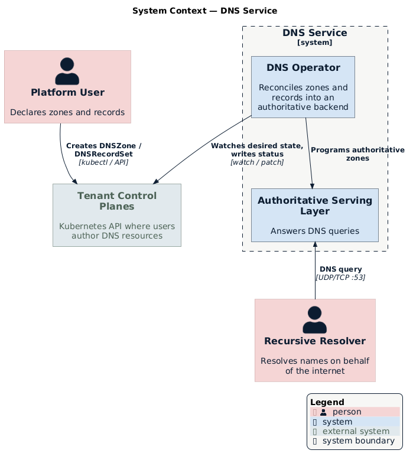

# DNS Service Architecture

The DNS service provides multi-tenant, Kubernetes-native authoritative DNS.
Platform users declare zones and records as ordinary Kubernetes resources in
their own control plane; the service carries that desired state down to an
authoritative DNS backend and publishes the resulting records to a globally
distributed serving layer.

The **DNS operator** is the control-plane component at the heart of the service.
It reconciles the user's resources and programs the backend. The DNS backend, the
serving layer, and a shared state store make up the rest of the system, and this
document describes how the operator and those components fit together.

## How It Works

Users author three kinds of resources: a `DNSZoneClass` that names the backend
and nameserver policy, a `DNSZone` for each domain, and `DNSRecordSet` resources
for the records within a zone. These resources live in the user's own **tenant
control plane**, so they inherit the platform's identity, RBAC, and audit
controls.

The operator runs in one of two roles that split the work across trust
boundaries:

- A **replicator** watches tenant control planes, mirrors the desired state into
  a shared authoritative cluster, and synthesizes status back up so users can
  see whether their DNS is live.
- A **downstream agent** runs next to the DNS backend, translates records into
  backend calls, and owns the authoritative zone data.

A read-only **serving layer** then replicates the authoritative data and answers
live DNS queries close to end users.

This separation keeps tenants off the DNS backend, hides the backend technology
and cluster topology, and gives the authoritative data a single writer.

## System Context

  

The tenant control plane holds the desired state. The operator reads that state,
programs the authoritative backend, and writes status back to the tenant control
plane. Recursive resolvers query the serving layer directly over standard DNS.
The [Technology Stack](#technology-stack) section lists the open-source
components that make up the service.

## Core Concepts

### Zones, Records, and Zone Classes

- **[`DNSZone`](./api-reference.md#dnszone)** models a single domain. Its status
  reports the authoritative nameservers and readiness.
- **[`DNSRecordSet`](./api-reference.md#dnsrecordset)** models the records for one
  owner name and type within a zone (A, AAAA, CNAME, ALIAS, TXT, MX, SRV, CAA,
  NS, SOA, PTR, TLSA, HTTPS, SVCB).
- **[`DNSZoneClass`](./api-reference.md#dnszoneclass)** is a cluster-scoped policy,
  analogous to a `StorageClass`, that selects the **backend** (via
  `controllerName`) and the **nameserver policy** for every zone that references
  it. The class is the seam that keeps backend choice out of individual zones.

See the [API Reference](./api-reference.md) for the full resource schema.

### Backends

A `DNSZoneClass` selects a backend by name through `spec.controllerName`. The
downstream agent acts only on zones whose class names a backend it implements, so
one deployment can host several classes and several backends side by side.
**PowerDNS** is the backend the operator implements today. The record-translation
and zone-management logic sit behind a narrow backend interface, so you can add
authoritative servers without changing the reconcilers.

See [DNS Backends](./backends/README.md) for the backend model and the
[PowerDNS backend](./backends/powerdns.md) for that backend's architecture.

### Multi-Tenancy via Control Plane Discovery

The operator isolates tenants by control plane rather than by namespace
convention. The replicator **discovers** the control planes it serves and
reconciles each one independently. Two discovery modes exist:

- **`single`** — the operator serves one upstream cluster, the cluster it runs
  in. This mode suits self-contained deployments and development.
- **`milo`** — the operator discovers per-project control planes from a platform
  control plane and connects to each one. This mode serves the multi-tenant
  platform.

Because the desired state lives in the tenant's own control plane, each tenant
sees only its own zones and records, and the operator never exposes its
authoritative cluster to tenants.

### Status Synthesis and Conditions

Every resource carries two conditions that the operator sets:

- **`Accepted`** — the resource is valid and its dependencies are satisfied.
- **`Programmed`** — the backend has realized the desired state.

The replicator mirrors realized status from the authoritative cluster back to the
tenant control plane. A user watching a `DNSZone` therefore sees `Programmed=True`
only after the zone actually serves. See [Replication Model](./replication.md)
for how the operator synthesizes status across the two clusters.

## Technology Stack

| Component | Technology | Purpose |
|-----------|------------|---------|
| **API model** | [Custom Resource Definitions](https://kubernetes.io/docs/concepts/extend-kubernetes/api-extension/custom-resources/) | Zones, records, and zone classes as native Kubernetes objects |
| **Controller runtime** | [controller-runtime](https://github.com/kubernetes-sigs/controller-runtime) + [multicluster-runtime](https://github.com/kubernetes-sigs/multicluster-runtime) | Reconciliation across one or many control planes |
| **Authoritative backend** | [PowerDNS Authoritative Server](https://doc.powerdns.com/authoritative/) | Serves authoritative zone data |
| **State replication** | [LightningStream](https://github.com/PowerDNS/lightningstream) + object storage | Replicates the authoritative LMDB store to the serving layer |

## API Resources

The operator serves these resources under `dns.networking.miloapis.com/v1alpha1`:

| Resource | Scope | Description |
|----------|-------|-------------|
| `DNSZoneClass` | Cluster | Selects backend and nameserver policy for zones |
| `DNSZone` | Namespaced | A single authoritative domain |
| `DNSRecordSet` | Namespaced | Records for one owner name and type within a zone |
| `DNSZoneDiscovery` | Namespaced | One-shot snapshot of a zone's live records |

See the [API Reference](./api-reference.md) for complete field documentation.

## Learn More

- [Deployment Topology](./topology.md) — Roles, control planes, and the serving
  layer
- [Replication Model](./replication.md) — Shadow objects, namespace mapping, and
  status synthesis
- [DNS Backends](./backends/README.md) — Backend model and available backends,
  including the [PowerDNS backend](./backends/powerdns.md)
- [API Reference](./api-reference.md) — Full resource schema and conditions

## References

- [PowerDNS Authoritative Server](https://doc.powerdns.com/authoritative/)
- [Kubernetes Custom Resources](https://kubernetes.io/docs/concepts/extend-kubernetes/api-extension/custom-resources/)
- [multicluster-runtime](https://github.com/kubernetes-sigs/multicluster-runtime)
- [LightningStream](https://github.com/PowerDNS/lightningstream)
- [C4 model](https://c4model.com) — notation used for the diagrams in these docs
