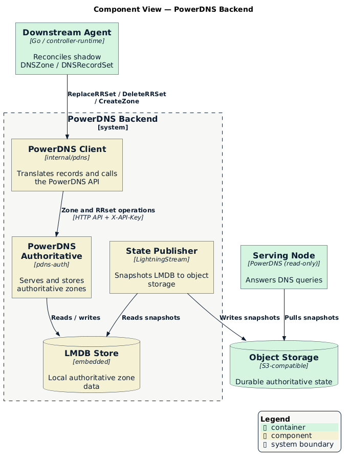

# PowerDNS Backend

[PowerDNS Authoritative Server](https://doc.powerdns.com/authoritative/) is the
backend the operator implements today. A zone opts in by referencing a
`DNSZoneClass` with `controllerName: powerdns`. This page documents how the
PowerDNS backend translates records, programs zones, stores data, and serves
queries. For the properties every backend shares, see the
[backend model](./README.md#backend-model).

  

## Record Translation

The PowerDNS client translates each typed `DNSRecordSet` entry into the
presentation format PowerDNS expects. Translation handles the details that DNS
record types require:

- Synthesizes the `SOA` serial (as `YYYYMMDDnn`) when a record omits it.
- Encodes `SVCB` and `HTTPS` service parameters.
- Quotes and escapes `TXT` content.
- Qualifies owner names against the zone and removes duplicate values.

## Zone and Record Programming

The client drives PowerDNS through its HTTP API, authenticating with an API key
in the `X-API-Key` header. For a zone, the agent ensures the zone exists and
applies the nameserver policy from its `DNSZoneClass`. For a record set, the
agent replaces the desired owners and deletes extraneous owners of the same
type. When PowerDNS rejects a change, the agent reports the failure on the
resource with reason `PDNSError` and a human-readable message.

## Storage and Serving

PowerDNS stores authoritative zone data in an embedded **LMDB** database. To
serve queries close to end users, the deployment replicates that database rather
than the query path:

1. A [LightningStream](https://github.com/PowerDNS/lightningstream) sidecar
   snapshots the LMDB store to shared, S3-compatible object storage.
2. Each serving node runs a read-only PowerDNS with a LightningStream sidecar
   that pulls the snapshots and answers queries.

Serving nodes hold only their local replica, so the deployment can add nodes
anywhere object storage is reachable. A serving node can also run a local
recursor to expand `ALIAS` records at query time. See
[Deployment Topology](../topology.md#authoritative-serving-and-state-replication)
for how the serving layer fits the wider system.

## Configuration

The agent connects to PowerDNS through environment variables:

| Variable | Default | Description |
|----------|---------|-------------|
| `PDNS_API_URL` | `http://127.0.0.1:8081` | PowerDNS HTTP API endpoint. |
| `PDNS_API_KEY` | — | API key (or use `PDNS_API_KEY_FILE`). |
| `PDNS_API_KEY_FILE` | — | Path to a file that contains the API key. |

The [`config/agent`](../../../config/agent) overlay bundles PowerDNS, the
recursor, and LightningStream alongside the agent, and wires the API key through
a shared volume. See [Deployment Topology](../topology.md) for the deployment
shape.

## Related

- [DNS Backends](./README.md) — The backend model that every backend shares
- [Deployment Topology](../topology.md) — Where the backend and serving layer run
- [API Reference](../api-reference.md#dnszoneclass) — `DNSZoneClass` schema and
  the `DNSOperator` PowerDNS settings
