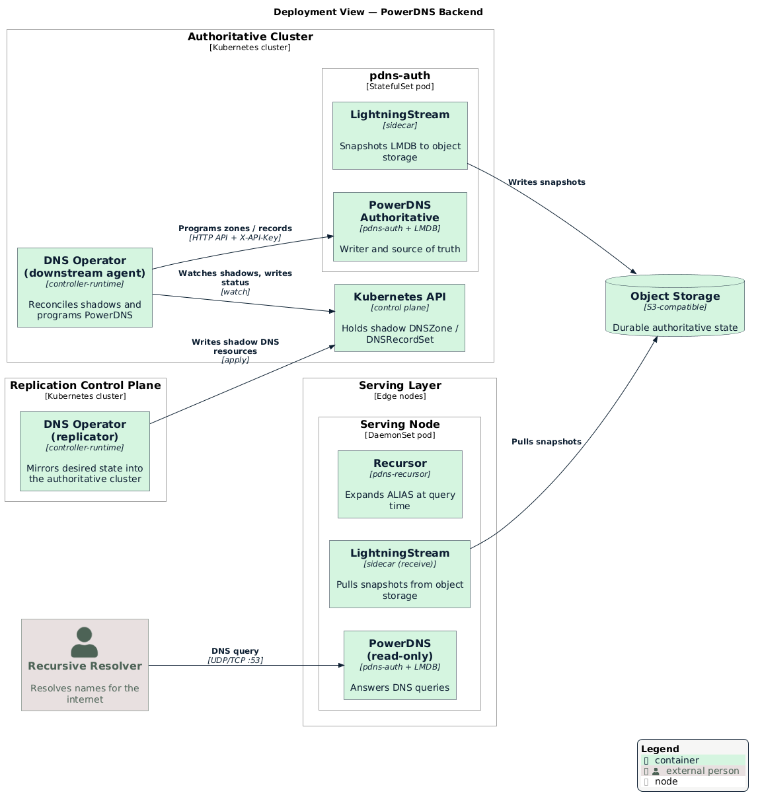

# PowerDNS Backend

[PowerDNS Authoritative Server](https://doc.powerdns.com/authoritative/) is the
backend the operator implements today. A zone opts in by referencing a
`DNSZoneClass` with `controllerName: powerdns`. This page documents how the
PowerDNS backend translates records, programs zones, stores data, and serves
queries. For the properties every backend shares, see the
[backend model](./README.md#backend-model).

The deployment view below shows where each component runs: the downstream agent
and the PowerDNS writer in the authoritative cluster (fed shadow resources by the
replicator through the cluster's Kubernetes API), and the read-only serving nodes
at the edge, replicating through shared object storage.

  

## Record Translation

The PowerDNS client translates each typed `DNSRecordSet` entry into the
presentation format PowerDNS expects. Translation handles the details that DNS
record types require:

- Synthesizes a date-based `SOA` serial (`YYYYMMDD01`) when a record omits it.
- Encodes `SVCB` and `HTTPS` service parameters.
- Quotes and escapes `TXT` content.
- Qualifies owner names against the zone and removes duplicate values.

## Zone and Record Programming

The client drives PowerDNS through its HTTP API, authenticating with an API key
in the `X-API-Key` header. For a zone, the agent ensures the zone exists and
applies the nameserver policy from its `DNSZoneClass`. For a record set, the
agent replaces the desired owners and deletes extraneous owners of the same
type. When PowerDNS rejects a change, the agent reports the failure on the
resource with reason `PDNSError` and a human-readable message.

## Storage and Serving

PowerDNS stores authoritative zone data in an embedded **LMDB** database. To
serve queries close to end users, the deployment replicates that database rather
than the query path:

1. A [LightningStream](https://github.com/PowerDNS/lightningstream) sidecar
   snapshots the LMDB store to shared, S3-compatible object storage.
2. Each serving node runs a read-only PowerDNS with a LightningStream sidecar
   that pulls the snapshots and answers queries.

Serving nodes hold only their local replica, so the deployment can add nodes
anywhere object storage is reachable. A serving node can also run a local
recursor to expand `ALIAS` records at query time. See
[Deployment Topology](../topology.md#authoritative-serving-and-state-replication)
for how the serving layer fits the wider system.

## Propagation and Timing

A record change reaches end users through four stages. Each stage adds delay, and
a different setting governs each one, so it helps to reason about them separately.

| Stage | What happens | What governs the delay |
|-------|--------------|------------------------|
| 1. Reconcile | The agent programs the change into the writer's PowerDNS through the HTTP API. | Controller queue latency, normally seconds. On a backend error the agent retries with exponential backoff, from `rateLimiterBaseDelay` (1s) up to `rateLimiterMaxDelay` (30s). |
| 2. Authoritative write | The writer's PowerDNS serves the change. It reads LMDB directly (`zone-cache-refresh-interval=0`), so no cache stands between the write and the answer. | Effectively immediate on the writer. |
| 3. Replicate to serving nodes | A LightningStream sidecar snapshots the LMDB to object storage; each serving node lists object storage, downloads new snapshots, and merges them. | The writer's `lmdb_poll_interval` plus each node's `storage_poll_interval` (see [LightningStream intervals](#lightningstream-intervals)), plus object-storage upload and download time — typically a few seconds. |
| 4. Resolver caching | Recursive resolvers and clients cache the answer until its TTL expires. They also cache a *missing* name for the zone's negative-cache TTL (the `SOA` minimum). | The record's TTL, and — for a newly added name — the negative-cache TTL of any earlier lookup. |

Stages 1–3 move a change from the API to every authoritative serving node,
typically within a few seconds. Stage 4 dominates what end users observe, because
a resolver keeps serving a cached answer until the TTL expires regardless of how
fast the authoritative servers update.

### LightningStream intervals

LightningStream drives stage 3. The deployment runs it with default intervals, so
a change reaches every serving node within a few seconds of becoming
authoritative on the writer, bounded mainly by object-storage latency:

| Setting | Default | Effect on propagation |
|---------|---------|-----------------------|
| `lmdb_poll_interval` | `1s` | How often the writer's sidecar checks LMDB for changes to snapshot. |
| `storage_poll_interval` | `1s` | How often a serving node lists object storage for new snapshots. |
| `storage_force_snapshot_interval` | `4h` | Writes a snapshot even with no changes, so an idle instance does not look stale. |
| `storage_retry_interval` | `5s` | Retry delay after a failed snapshot upload or download. |

Lowering the poll intervals shortens propagation at the cost of more frequent
storage listings; raising them does the reverse. These intervals govern only how
fast a change reaches the serving nodes — end users still see it no sooner than
their cached TTL allows.

Two practical consequences follow:

- **To make a change take effect quickly, lower the record's TTL before you make
  it.** Set a short TTL, wait for the old TTL to expire everywhere, change the
  record, then raise the TTL again. The serving pipeline itself adds only seconds
  to minutes; the TTL sets the ceiling.
- **A brand-new name can appear slowly if something looked it up first**, because
  resolvers cached the negative answer for the zone's negative-cache TTL. The
  operator's default `SOA` sets this value (see
  [Replication Model](../replication.md#default-soa-and-ns-records)).

## Configuration

The agent connects to PowerDNS through environment variables:

| Variable | Default | Description |
|----------|---------|-------------|
| `PDNS_API_URL` | `http://127.0.0.1:8081` | PowerDNS HTTP API endpoint. |
| `PDNS_API_KEY` | — | API key (or use `PDNS_API_KEY_FILE`). |
| `PDNS_API_KEY_FILE` | — | Path to a file that contains the API key. |

The PowerDNS record-set controller adds its own tuning under
`controllers.dnsRecordSetPowerDNS` in the [`DNSOperator` server
config](../topology.md#operator-configuration):

| Field | Default | Description |
|-------|---------|-------------|
| `controllers.dnsRecordSetPowerDNS.maxConcurrentReconciles` | `4` | Concurrent reconciles for the PowerDNS record-set controller. |
| `controllers.dnsRecordSetPowerDNS.rateLimiterBaseDelay` | `1s` | Exponential backoff base delay. |
| `controllers.dnsRecordSetPowerDNS.rateLimiterMaxDelay` | `30s` | Exponential backoff max delay. |

The [`config/agent`](../../../config/agent) base bundles PowerDNS, the recursor,
and LightningStream alongside the agent and wires the API key through a shared
volume; the runnable [`config/overlays/agent-powerdns`](../../../config/overlays/agent-powerdns)
overlay adds the namespace and a storage backend. See
[Deployment Topology](../topology.md) for the deployment shape.

## Related

- [DNS Backends](./README.md) — The backend model that every backend shares
- [API Reference](../api-reference.md#dnszoneclass) — `DNSZoneClass` schema
- [Deployment Topology](../topology.md#operator-configuration) — The generic
  `DNSOperator` server config
