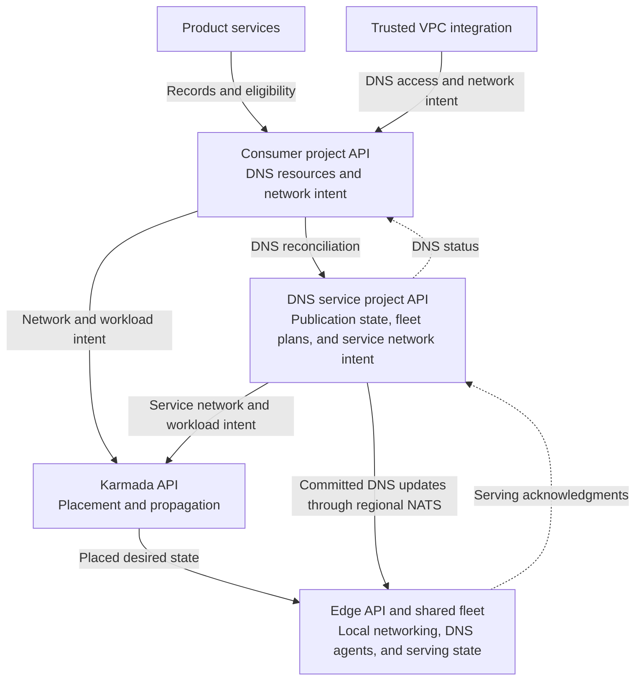
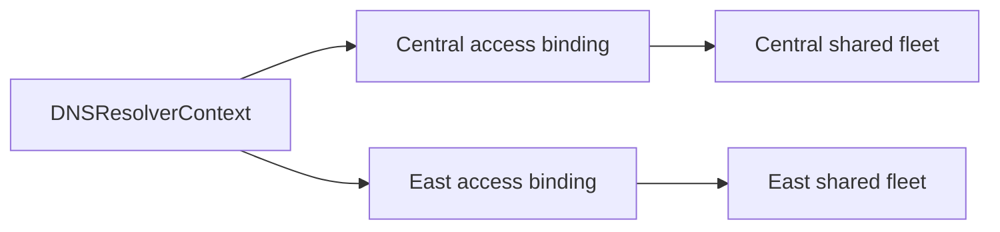
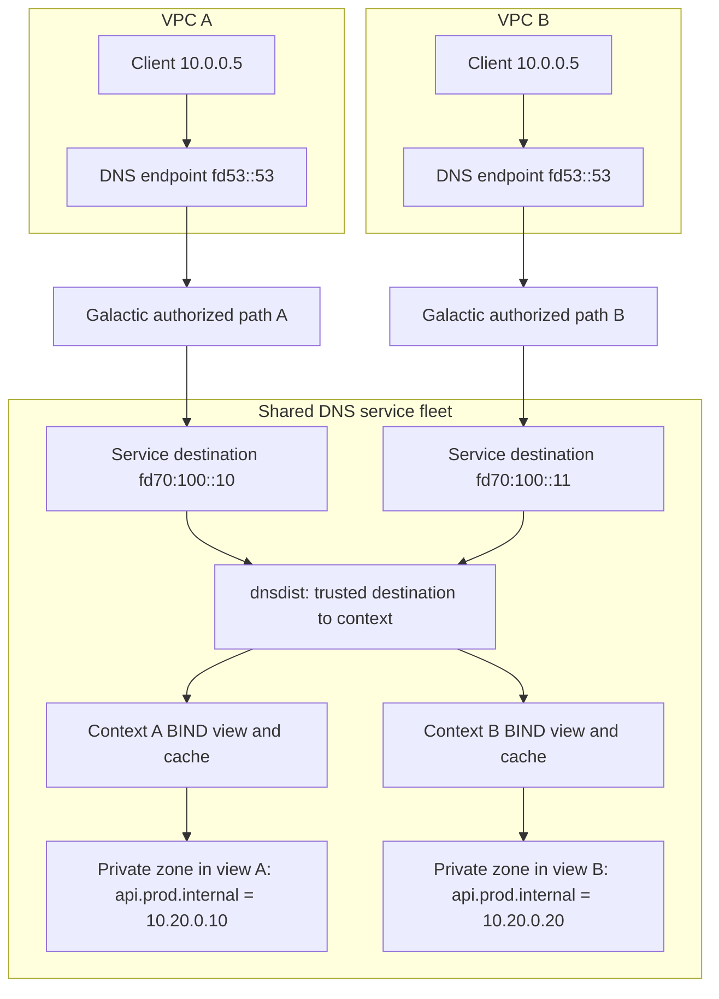
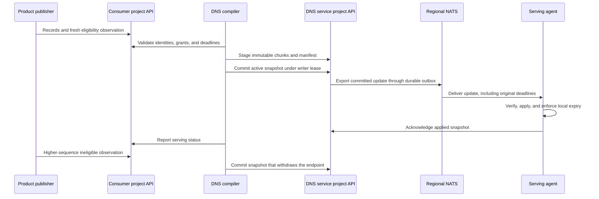

# Internal DNS architecture

- [Summary](#summary)
- [Motivation](#motivation)
  - [Goals](#goals)
  - [Non-Goals](#non-goals)
- [Proposal](#proposal)
  - [Risks and mitigations](#risks-and-mitigations)
- [Design Details](#design-details)
  - [Control-plane boundaries](#control-plane-boundaries)
  - [Contexts and regional access](#contexts-and-regional-access)
  - [Query path and network identity](#query-path-and-network-identity)
  - [Publication and service discovery](#publication-and-service-discovery)
  - [API design](#api-design)
  - [Integration boundaries](#integration-boundaries)
- [Production Readiness Review Questionnaire](#production-readiness-review-questionnaire)
- [Implementation History](#implementation-history)
- [Drawbacks](#drawbacks)
- [Alternatives](#alternatives)
- [Infrastructure Needed](#infrastructure-needed)

## Summary

Internal DNS lets resources resolve private names within a VPC. Each network has
a managed namespace and can use additional private zones. Product services
publish names automatically, and shared regional fleets serve many VPCs with
isolated DNS contexts.

The [product enhancement](https://github.com/datum-cloud/enhancements/pull/922)
defines the consumer experience. The
[Galactic design](https://github.com/datum-cloud/galactic/blob/main/docs/enhancements/networking/private-service-connect/README.md)
defines private connectivity. This enhancement defines the DNS architecture and
[API design](#api-design).

## Motivation

Resources need private names without a zone choice on every resource. The
platform must isolate overlapping names and addresses across networks and
withdraw endpoints that are no longer eligible.

### Goals

- Serve private zones through the VPC's inherited resolver configuration.
- Allocate default names and support additional custom zones.
- Isolate overlapping names, addresses, and resolver caches across DNS contexts.
- Accept publications from distributed product control planes and withdraw
  expired or ineligible endpoints.
- Scale shared serving capacity across regions without deployments per VPC.

### Non-Goals

- Designing Galactic's private connectivity APIs or packet handling.
- Having DNS controllers inspect networking or product resources.
- Defining application health policies for product services.
- Changing public DNS behavior or defining cross-project zone sharing.

## Proposal

Trusted VPC integration provisions a DNS context and regional resolver access.
DNS allocates a managed namespace, accepts explicit custom zone associations,
and compiles product publications into private serving state. Consumers use a
stable resolver address in their VPC while the platform selects shared capacity.

### Risks and mitigations

- Tenant leakage: authorize network identity before cache lookup, isolate
  resolver views, and test overlapping zones and forged identities.
- Stale endpoints or access: preserve original deadlines, fence writers and
  replay, and enforce expiry locally at serving nodes.
- Shared fleet failure: qualify configuration activation, readiness, capacity,
  and regional failure handling before release.

## Design Details

### Control-plane boundaries

The DNS service runs in its own VPC. Galactic exposes it through a private
endpoint in each consumer VPC. The diagram shows which API owns each resource;
it does not prescribe where controller processes run.



- **Consumer project:** Owns contexts, access bindings, zones, naming policy, and
  publications. VPC integration writes access intent; product services publish
  records and eligibility; DNS reports serving status.
- **DNS service project:** Owns writer leases, snapshots, outboxes, fleet plans,
  and the service's network intent.
- **Karmada:** Places network and workload intent. Guest resolver settings travel
  as desired state; DNS publications use their own delivery path.
- **Edge:** Owns local networking, shared serving workloads, and checkpoints.

DNS uses authenticated project clients. VPC integration and product publishers
translate their resources into DNS intent; DNS does not watch their APIs.

### Contexts and regional access

A logical network has one DNS context across its locations. The context selects
its managed namespace and associated zones. Separate contexts can use identical
zone names and overlapping IP addresses. Sharing a zone requires an explicit
association.



Bindings live in the consumer project API; `region` selects serving capacity.
Each has independent identity, authorization, and readiness. Publication is
asynchronous, and a failed region must not block healthy regions. Regional access
does not imply that discovery returns only region-local endpoints.

### Query path and network identity

Both VPCs can expose the same DNS address and contain the same client IP. Galactic
authorizes the private path and translates its destination into a distinct
service-side identity. DNS maps that identity to a context before consulting a
cache or selecting private zones.



Galactic verifies the source VPC lifetime and route authorization before
translating the destination. DNS trusts that path, not client addresses, ECS, or
client-supplied PROXY headers. Consumers cannot select another context by
addressing its service-side destination.

Shared node and regional tiers use:

1. **dnsdist** to select the context before lookup, with private packet caching
   disabled.
2. **BIND views** to isolate positive and negative caches. Node views forward to
   context-specific regional destinations. Regional views host the context's
   private authoritative zones and recurse for other names. Views share resolver
   processes; each context has its own zone selection and cache.

[dnsdist PROXYv2](https://www.dnsdist.org/advanced/passing-source-address.html)
preserves the destination. [BIND PROXY access controls](https://bind9.readthedocs.io/en/v9.20.2/reference.html#namedconf-statement-allow-proxy)
restrict trusted peers and listeners. A shared pool member must have current
configuration and authorization for every assigned context.

[BIND views](https://bind9.readthedocs.io/en/v9.20.2/reference.html#view-block-grammar)
select the private zones visible to each context. Keep caches separate and reject
unmatched destinations before lookup.

### Publication and service discovery

A registration reserves a name and record types. A grant authorizes a product
publisher. A contribution supplies records and a time-limited eligibility
observation. DNS compiles accepted contributions into a complete zone snapshot.



Each zone has one compiler owner, fenced by a compare-and-swap lease. Takeover
advances the writer epoch; revisions increase within it. Agents reject older
versions. The compiler stages immutable chunks and a manifest, then commits its
active pointer. Kubernetes API storage retains this state and a durable outbox;
exporters repair missing outboxes after crashes.

Regional agents render committed snapshots as zone files, validate and activate
them in the associated BIND views, then acknowledge serving.

Regional [NATS JetStream](https://docs.nats.io/nats-concepts/jetstream) delivery is
at least once. Every serving replica receives its complete assignment and
acknowledges applied state separately from broker receipt. Queries use local
state without contacting project APIs or the broker.

Products define eligibility for instance identity, application discovery, or
stable service addresses. Serving agents enforce contribution freshness and
access deadlines independently. Replay and restart cannot extend them; expired
endpoints are withdrawn locally. Retained tombstones and writer fences prevent
restoration, and watchdogs remove members that cannot enforce expiry.

A reserved name without eligible addresses returns NODATA. Missing required
private state returns SERVFAIL; unknown or expired access returns REFUSED.
Private names never fall back to public resolution. Disable stale private
answers and bound dynamic TTLs; withdrawal budgets include client caching.

### API design

All examples use `dns.networking.miloapis.com/v1alpha1`. The project API assigns
object UIDs and generations. Reference UIDs, timestamps, addresses, and allocated
suffixes below are illustrative. `status` examples show controller output and
are not fields consumers submit when creating resources.

#### Ownership and validation

Admission pins reference UIDs and publication policy generations, authenticates
project and source-cluster identity, and enforces field ownership, including
shared status fields. Publishers cannot grant themselves rights or authorize
resolver access. Consumer references stay within a project.

#### Context and regional access

VPC integration creates an opaque DNS scope. DNS does not dereference the
`consumerID` or watch a networking resource.

```yaml
apiVersion: dns.networking.miloapis.com/v1alpha1
kind: DNSResolverContext
metadata:
  name: application
spec:
  # Immutable lifetime identity supplied by trusted VPC integration.
  consumerID: "11111111-1111-4111-8111-111111111111/22222222-2222-4222-8222-222222222222"
  # Allocate a default private namespace without asking users to choose a zone.
  managedNamespace:
    enabled: true
status:
  # DNS-owned output; publishers use this allocated zone and suffix.
  managedNamespace:
    dnsZoneRef:
      name: managed-application
      uid: 44444444-4444-4444-8444-444444444444
    suffix: vpc-a7c9.project-p4e2.internal
  # DNS-owned fencing epoch for trusted access authorization.
  accessWriterEpoch: 3
  # Regional assignments do not move this object out of the project API.
  servingTargets:
    - region: central
      shard: shared-0
---
apiVersion: dns.networking.miloapis.com/v1alpha1
kind: DNSResolverAccessBinding
metadata:
  name: application-central
spec:
  # Pin the context lifetime so recreation cannot inherit old access.
  contextRef:
    name: application
    uid: 33333333-3333-4333-8333-333333333333
  # Select the serving region, not a separate project control plane.
  region: central
  queryIdentity:
    # Galactic supplies an authorized service-side destination before DNS lookup.
    type: DestinationAddress
    # This is distinct from the well-known address exposed inside the VPC.
    value: fd70:100::10
  # Permit DNS over both transports at the authorized destination.
  port: 53
  transports: [UDP, TCP]
  authorization:
    # Match the DNS-issued context epoch; stale issuers cannot restore access.
    writerEpoch: 3
    # Renewals advance monotonically within this access-binding lifetime.
    sequence: 27
    # Preserve this deadline through transport, replay, and local installation.
    validUntil: "2026-10-08T20:05:00Z"
```

Access reports `Accepted` after validation and `Ready` after required members
apply current authorization and configuration. Context, region, query identity,
port, transports, and authorization epoch are immutable per access lifetime.
Renewals advance the sequence with a bounded deadline; destinations are unique
within their routing scope. Galactic owns the consumer frontend and network
lease separately.

#### Private zones and associations

Users can add a custom zone to the context and create static records in it.
Private zones do not require public domain verification or public delegation.

```yaml
apiVersion: dns.networking.miloapis.com/v1alpha1
kind: DNSZone
metadata:
  name: production
spec:
  # Visibility is immutable. The existing default remains Public.
  visibility: Private
  # Different contexts can associate separate zones with this same apex.
  domainName: prod.internal
  # Select private backend policy; users do not choose fleet instances.
  dnsZoneClassName: datum-internal-dns
---
apiVersion: dns.networking.miloapis.com/v1alpha1
kind: DNSZoneAssociation
metadata:
  name: production-application
spec:
  # Both objects belong to this project. Pin each object's lifetime.
  dnsZoneRef:
    name: production
    uid: 88888888-8888-4888-8888-888888888888
  # DNS consumes a context reference, not a VPC reference.
  resolverContextRef:
    name: application
    uid: 33333333-3333-4333-8333-333333333333
---
apiVersion: dns.networking.miloapis.com/v1alpha1
kind: DNSRecordSet
metadata:
  name: database
spec:
  # Existing record API: a same-project name reference to its zone.
  dnsZoneRef:
    name: production
  recordType: A
  records:
    # Static records have no endpoint eligibility lease.
    - name: database
      ttl: 30
      a:
        content: 10.20.0.50
```

A context can use several zones. Reject duplicate apexes within a context and
conflicts between static records and reserved names. Select parent and child
zones by longest suffix. Separate contexts can explicitly share a zone or use
independent zones with the same apex. Static records have no health lease.

#### Automatic naming and additional names

DNS allocates the managed zone and exposes it in context status. A naming policy
adds custom names without a zone choice on each Compute or Connect resource.

```yaml
apiVersion: dns.networking.miloapis.com/v1alpha1
kind: DNSNamingPolicy
metadata:
  name: application-production-names
spec:
  # Apply naming rules to this DNS scope.
  resolverContextRef:
    name: application
    uid: 33333333-3333-4333-8333-333333333333
  additionalNames:
    # Add instance identity names, such as web-01.instances.prod.internal.
    - registrationClass: InstanceIdentity
      dnsZoneRef:
        name: production
        uid: 88888888-8888-4888-8888-888888888888
      namePrefix: instances
    # Add discovery names, such as api.services.prod.internal.
    - registrationClass: ServiceDiscovery
      dnsZoneRef:
        name: production
        uid: 88888888-8888-4888-8888-888888888888
      namePrefix: services
```

Every target zone must be associated with the context. The proposed classes are
`InstanceIdentity`, `ServiceDiscovery`, `ServiceVIP`, and `ServiceExport`.
Product integrations apply the appropriate rule when reserving names. DNS does
not inspect the underlying product resource to determine its class.

#### Product publication

Compute can reserve a name in the managed namespace, obtain a scoped publisher
grant, and publish eligible interface addresses. Connect uses the same contract
with its own publisher principal and export eligibility policy.

```yaml
apiVersion: dns.networking.miloapis.com/v1alpha1
kind: DNSRegistration
metadata:
  name: instance-web-01
spec:
  # Select the managed zone allocated for the resource's DNS context.
  dnsZoneRef:
    name: managed-application
    uid: 44444444-4444-4444-8444-444444444444
  # Reserve this relative owner name, rather than one particular IP address.
  name: web-01.instances
  # Constrain which record types contributions can populate.
  recordTypes: [A, AAAA]
  # Publish only contributions with a current eligible observation.
  publicationPolicy: EligibleContributions
  # Bound client caching; this does not replace the observation deadline.
  ttlSeconds: 30
  # Optional descendant reservations must not overlap other owners.
  reservedDescendants: []
status:
  # DNS-owned output for product status and consumer display.
  canonicalFQDN: web-01.instances.vpc-a7c9.project-p4e2.internal
---
apiVersion: dns.networking.miloapis.com/v1alpha1
kind: DNSContributionGrant
metadata:
  name: web-01-compute
spec:
  # Pin both the registration lifetime and the policy being authorized.
  registrationRef:
    name: instance-web-01
    uid: 55555555-5555-4555-8555-555555555555
    generation: 1
  # Audit label; the authenticated principal below authorizes the writer.
  producerID: compute
  principal:
    # Trusted source-cluster identity distinguishes distributed publishers.
    clusterUID: 99999999-9999-4999-8999-999999999999
    subject: system:serviceaccount:compute-system:dns-publisher
  # Scope the writer to these types and owner names.
  recordTypes: [A, AAAA]
  nameScopes: [web-01.instances]
status:
  # DNS allocates the epoch; the producer cannot choose its own fencing token.
  activeWriterEpoch: 3
  # Identify the grant and registration policy versions DNS accepted.
  observedGrantGeneration: 1
  observedRegistrationGeneration: 1
---
apiVersion: dns.networking.miloapis.com/v1alpha1
kind: DNSRecordContribution
metadata:
  name: web-01-endpoint
spec:
  # Bind the contribution to the reserved name and its current policy.
  registrationRef:
    name: instance-web-01
    uid: 55555555-5555-4555-8555-555555555555
    generation: 1
  # Bind the producer to its authorized grant lifetime and policy.
  grantRef:
    name: web-01-compute
    uid: 66666666-6666-4666-8666-666666666666
    generation: 1
  # Reuse the existing typed record representation.
  recordSets:
    - recordType: A
      records:
        - name: web-01.instances
          ttl: 30
          a:
            content: 10.20.0.10
    - recordType: AAAA
      records:
        - name: web-01.instances
          ttl: 30
          aaaa:
            content: fd20::10
status:
  # Producer-owned: this observation covers the current contribution spec.
  observedGeneration: 1
  # Producer-owned: echo the DNS-issued grant epoch.
  writerEpoch: 3
  # Producer-owned: order observations within that epoch.
  sequence: 18
  # Producer-owned: product policy determines readiness for this name's purpose.
  eligible: true
  reason: NetworkInterfaceProgrammed
  # Producer-owned: DNS must preserve this original freshness deadline.
  validUntil: "2026-10-08T20:01:00Z"
  # DNS-owned: the publication revision that included this contribution.
  publishedRevision: 12
```

Publishers preserve DNS-owned status fields and observe the current contribution
generation. An ineligible endpoint gets a higher-sequence observation with
`eligible: false`; recovery requires a fresh eligible observation. Publisher
loss does not renew the original deadline. Admission checks the principal,
grant epoch, sequence, record scope, and freshness bound.

#### DNS service project contracts

These resources are internal to the DNS service project. Consumers and product
publishers cannot write them. Examples show selected fields that explain
coordination; they are not complete generated serving plans or transport payloads.

The proposed `DNSResolverBinding` groups four concerns: source identity,
regional placement, generated serving configuration, and access authorization.
It binds a consumer DNS context to shared capacity; it does not describe a VPC
or create a resolver deployment.

```yaml
apiVersion: dns.networking.miloapis.com/v1alpha1
kind: DNSResolverBinding
metadata:
  name: application-central
  namespace: dns-platform
spec:
  source:
    # Scope source references to the authenticated consumer project.
    projectUID: 11111111-1111-4111-8111-111111111111
    # Pin the DNS context lifetime; DNS does not dereference a VPC.
    resolverContextRef:
      name: application
      uid: 33333333-3333-4333-8333-333333333333
    # Retain the exact regional access authorization that produced this plan.
    accessBindingRef:
      name: application-central
      uid: aaaaaaaa-aaaa-4aaa-8aaa-aaaaaaaaaaaa
  placement:
    # Identify shared capacity; these fields do not select the source API.
    region: central
    shard: shared-0
  configuration:
    # Fence plan replacement. This is distinct from metadata.generation.
    generation: 1
    # Order configuration changes within this plan generation.
    revision: 7
    listeners:
      # Node-tier service destination, reached through the private network path.
      node:
        address: fd70:100::10
        port: 53
        transports: [UDP, TCP]
      # Regional-tier destination used by the context's node resolver view.
      regional:
        address: fd70:200::10
        port: 53
        transports: [UDP, TCP]
    zoneRefs:
      # Include only private zones explicitly associated with the source context.
      - name: managed-application
        uid: 44444444-4444-4444-8444-444444444444
      - name: production
        uid: 88888888-8888-4888-8888-888888888888
  authorization:
    # Copy the accepted access epoch, sequence, and deadline without renewal.
    writerEpoch: 3
    sequence: 27
    validUntil: "2026-10-08T20:05:00Z"
```

Source and zone references resolve in `source.projectUID`, not the DNS service
namespace. Source identity is immutable. The region and node listener match the
access binding; DNS allocates the regional listener.

Configuration generation fences plan replacement; revision orders its updates.
Authorization copies the accepted access epoch, sequence, and deadline. Serving
acknowledgments identify the binding UID and both version sets; readiness
requires current acknowledgments from all required members.

Resolver engine, isolation, deployment model, and dnsdist cache policy belong to
shared fleet configuration. The nested binding is proposed; the prototype is flat.

DNS-owned publication resources retain the compiler lease and active pointer
(`DNSPublicationOwnership`), immutable snapshot data (`DNSPublicationManifest`
and `DNSPublicationChunk`), and durable delivery intent (`DNSTransportOutbox`).
Their storage schemas can be reviewed with the implementation.

#### Compatibility and API review

Prototype schema, controller, transport, and agent migration must preserve UID,
configuration, and authorization fences and original deadlines. The prototype's
authoritative backend must be replaced with BIND zone materialization and
revalidated for tenant isolation and expiry. Review naming conflicts, grant
revocation, field ownership, freshness bounds, regional readiness, and snapshot
limits before stabilizing the APIs.

### Integration boundaries

Reuse project discovery, authenticated clients, record types, certificates, and
release tooling from
[infra](https://github.com/datum-cloud/infra/tree/main/apps/dns-operator).
Add private admission, compilation, export, and serving agents. Public
LightningStream replication does not provide private snapshot activation.

## Production Readiness Review Questionnaire

Production readiness review remains open. Resolve the following requirements
before release.

### Feature Enablement and Rollback

Define separate alpha controls for publication and serving. Public visibility
remains the default. Revoke access before draining private capacity; dependent
workloads lose resolution. Reenabling requires fresh authorization and observations.

### Rollout, Upgrade and Rollback Planning

Qualify tenant isolation, expiry, failover, replay, and upgrade/rollback over
Galactic UDP and TCP paths, including guest resolver configuration. Expand by
context and region after setting withdrawal budgets and tombstone retention.

### Monitoring Requirements

Measure query latency/errors, publication lag, outbox backlog, expiry delay, and
activation failures. Use bounded metric labels and per-context API status.
Availability, latency, and withdrawal SLOs remain to be defined.

### Dependencies

Project APIs, Galactic/Karmada, NATS, and the DNS fleet support updates and
connectivity. API or broker outages delay updates while installed state remains
subject to its original deadlines; network authorization expires independently.

### Scalability

Measure context capacity, renewal/write rates, snapshot size, transport fanout,
cache memory, reload time, and query throughput. Bound chunks and retained
history; establish supported limits and regional failover capacity before release.

### Troubleshooting

Trace project/context/access UIDs through authorization, committed snapshots,
and serving acknowledgments. Inspect expiry for REFUSED, private state for
SERVFAIL, and product eligibility for NODATA.

## Implementation History

2026-10-08: Architecture proposal
[#229](https://github.com/datum-cloud/dns-operator/pull/229) and initial private-zone
boundary [#230](https://github.com/datum-cloud/dns-operator/pull/230).

## Drawbacks

Shared BIND views increase fleet complexity and failure scope. Leases, snapshots,
and freshness renewals add coordination state and API traffic.

## Alternatives

PowerDNS Recursor and CoreDNS remain options if they meet the same tenant
isolation and capacity requirements.

## Infrastructure Needed

A DNS service VPC, Galactic private connectivity, shared serving capacity,
protected listener-address allocation, durable project storage, and
secured NATS capacity. Review regional broker placement and failover policy.
