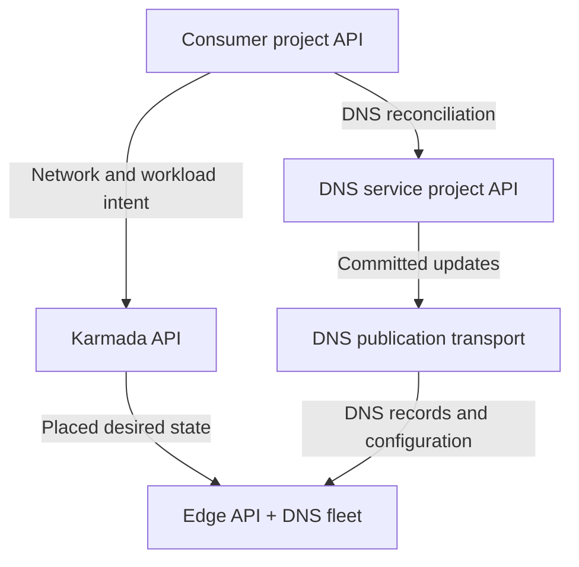
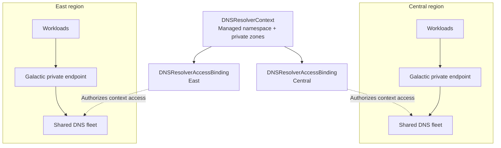
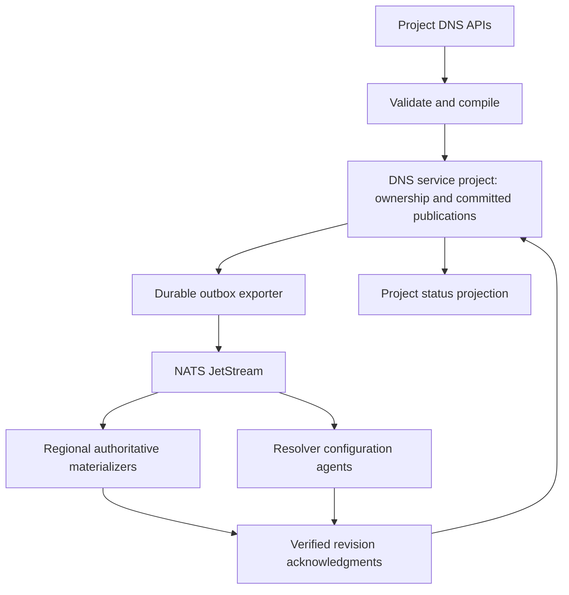
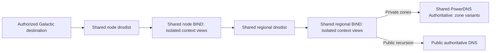
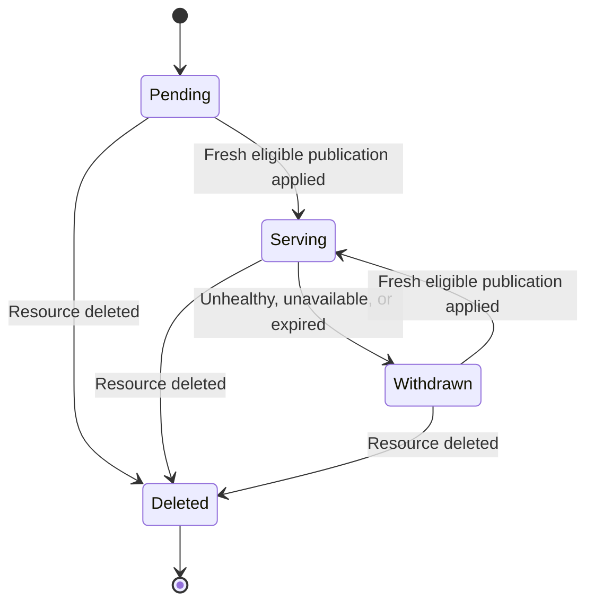

# Internal DNS component design

Status: Proposed. These contracts describe the local prototype and require API
and serving qualification before release.

The [product enhancement](https://github.com/datum-cloud/enhancements/pull/922)
defines the consumer experience. The [cross-service overview](https://github.com/datum-cloud/enhancements/blob/docs/internal-dns-product-proposal/architecture/deliver/dns/internal-dns/README.md)
defines integration boundaries. This document owns the DNS control plane,
publication contracts, tenant isolation, and shared serving configuration.

## Control planes

The DNS service runs in its own VPC and serves many consumer networks through a
shared fleet. The following diagram shows API boundaries and update paths.
Controllers can run in a management cluster while writing to these APIs.



DNS acknowledgments return to the service project. Network and workload
observations return through Karmada. Owning controllers project status into the
consumer project.

| Control plane | Resources and ownership |
| --- | --- |
| Consumer project | Private zones, records, associations, managed naming, registrations, grants, and contributions. Trusted networking integration manages `DNSResolverContext` and `DNSResolverAccessBinding`; DNS writes their status. Product services publish records. |
| DNS service project | DNS-owned publication ownership, manifests, chunks, outboxes, internal `DNSResolverBinding` assignments, and allocation claims. Also holds the service's own network intent. |
| Karmada | Network and workload projections, location placement, propagation policies, and selected edge observations. Networking and product controllers own these projections. |
| Edge | Local network contexts, interfaces, VPCs, attachments, `ServiceEndpoint` and `ServiceRoutePolicy` resources, shared serving workloads, and checkpoints. Edge controllers and serving agents own local state. |

DNS coordination retains each consumer's trusted project and source identities.
Controller replicas share authoritative storage for each publication and
serving-plan ownership domain. Product publishers cannot write that storage or
grant resolver access.

Networking `NetworkContext` describes a network at a location;
`DNSResolverContext` defines its DNS scope. Resolver settings needed at the edge
must travel as desired state in the networking projection. The existing
propagation contract does not carry source status. DNS publications follow their
own delivery path.

## Contexts and regional access

One logical network has one DNS context across its locations. That context
selects its managed namespace and associated private zones. Separate contexts
can use overlapping names and addresses. Zone sharing requires explicit
associations.



Access bindings live in the consumer project API. Each has its own serving
target, destination, renewal, deadline, and readiness. Expiring East access
leaves Central access and the context intact. Network or context recreation
receives a new lifetime identity; stale updates cannot restore old access.

The current `region` field identifies the serving target because the project
API can hold access for several regions. Trusted networking integration supplies
it. A future location reference could determine placement instead. Regional
access does not change zone contents or choose nearby application endpoints.
Region-to-cell mapping, resolver failover, and discovery locality remain open.

DNS treats the context's consumer identity as opaque. Networking owns its mapping
to logical networks and regional VPCs. DNS does not discover VPCs or attachments.
Adding a VPC adds data and authorization to the shared fleet.

## Context and access contracts

Trusted networking integration writes context and access specs in the consumer
project API. DNS writes status and issues writer epochs. Product publishers
cannot create contexts or renew access. DNS does not read VPC or attachment APIs.

The following proposed manifests show the integration contract. Names, UIDs,
addresses, and deadlines are illustrative; the resources are not in the released
API bundle.

```yaml
apiVersion: dns.networking.miloapis.com/v1alpha1
kind: DNSResolverContext
metadata:
  name: application-network-dns
  namespace: project-a
spec:
  # Immutable logical consumer lifetime; opaque to DNS.
  consumerID: "22222222-2222-4222-8222-222222222222"
  managedNamespace:
    enabled: true
---
apiVersion: dns.networking.miloapis.com/v1alpha1
kind: DNSResolverAccessBinding
metadata:
  name: application-network-dns-central
  namespace: project-a
spec:
  contextRef:
    name: application-network-dns
    # API-assigned context UID prevents access surviving context recreation.
    uid: "33333333-3333-4333-8333-333333333333"
  # Serving target; not a new zone scope or discovery-locality policy.
  region: us-central-1
  queryIdentity:
    type: DestinationAddress
    # Destination received by DNS after Galactic frontend translation.
    value: "fd70:100::10"
  port: 53
  transports: [UDP, TCP]
  authorization:
    # DNS-issued epoch and increasing writer sequence fence stale renewals.
    writerEpoch: 3
    sequence: 27
    validUntil: "2026-10-08T12:05:00Z"
```

`consumerID` identifies the logical consumer independently of provider VPC UIDs.
The context UID fences DNS state. `queryIdentity` binds one authorized serving
destination to that context. The integration renews authorization before
`validUntil`; DNS serving agents enforce expiration locally. The managed suffix
and DNS-issued epoch are exposed through context status.

`DNSZoneAssociation` and `DNSNamingPolicy` use UID-pinned `resolverContextRef`
references. `DNSResolverBinding` is a service-owned fleet plan. The prototype
retains legacy `vpcUID` wire fields for context UIDs; this compatibility does not
permit DNS to discover networking resources.

## Distributed publication

Product publishers reserve names with `DNSRegistration`, receive scoped
`DNSContributionGrant` authorization, and publish typed records with
`DNSRecordContribution`. Contributions report eligibility, writer epoch,
sequence, and validity deadline. Private static records use `DNSRecordSet`.



API storage holds durable ownership, manifests, chunks, outboxes, and serving
assignments. Conditional writes and writer epochs fence concurrent controllers.
Exporters retry committed updates; regional agents reject stale generations and
preserve expiration deadlines across replay and restart. The design does not
require PostgreSQL. NATS transports DNS intent; it is not queried to answer DNS.

Authoritative materializers apply accepted publications to private PowerDNS
replicas. Resolver agents apply destination mappings, views, and shared-pool
membership. Acknowledgments report verified applied revisions. A broker
acknowledgment alone does not establish query readiness.

## Shared serving and isolation

The serving candidate uses dnsdist, shared BIND resolver processes with isolated
views, and PowerDNS Authoritative for private zone variants. Node and regional
tiers use shared processes; adding a context adds configuration and data.
Resolver choice and capacity remain subject to qualification.



The destination selects the context before any cache lookup. dnsdist forwards
trusted original-destination metadata to private resolver listeners; each BIND
view forwards through its assigned regional destination. Service-owned source
markers select authoritative variants. Consumer DNS metadata and source address
ranges do not select views. Backend listeners accept only authorized service
traffic. Unknown mappings fail closed; answers and caches remain isolated.

A shared-pool replica becomes eligible only after it has every assigned context
at the required configuration revision. Failover stays within the same context
and serving assignment. The [Private Service Connect design](https://github.com/datum-cloud/galactic/blob/docs/private-service-connect-architecture/docs/enhancements/networking/private-service-connect/README.md) owns
attachment authorization, destination translation, and the return path. DNS
owns listener configuration and context selection.

## Publication and service discovery

Product services such as Compute and Connect publish addresses and endpoint
eligibility through their project DNS APIs. DNS validates ownership, compiles
records, and distributes them to serving locations. Zone owners manage custom
records. Record publication and workload resolver setup are separate paths.

Service discovery follows this lifecycle:



Instance identity names follow instance and address lifecycle; application
health does not automatically remove them. Services with stable addresses manage
backend health themselves. Connector exports publish selected reachable
services. Custom records do not receive automatic health checks.

Serving uses applied state without consulting a product control plane per query.
Lifetime and ordering checks prevent delayed updates from restoring deleted
records or replacing newer state. During an outage, records and access remain
usable only until their validity deadlines. Discovery names with no eligible
endpoints return no endpoint addresses. Unsafe private resolution fails.

Cached answers can persist until their DNS time to live (TTL) expires.
Publication, withdrawal, freshness, and access targets remain release decisions.
Product status distinguishes record readiness from resolver access readiness.
