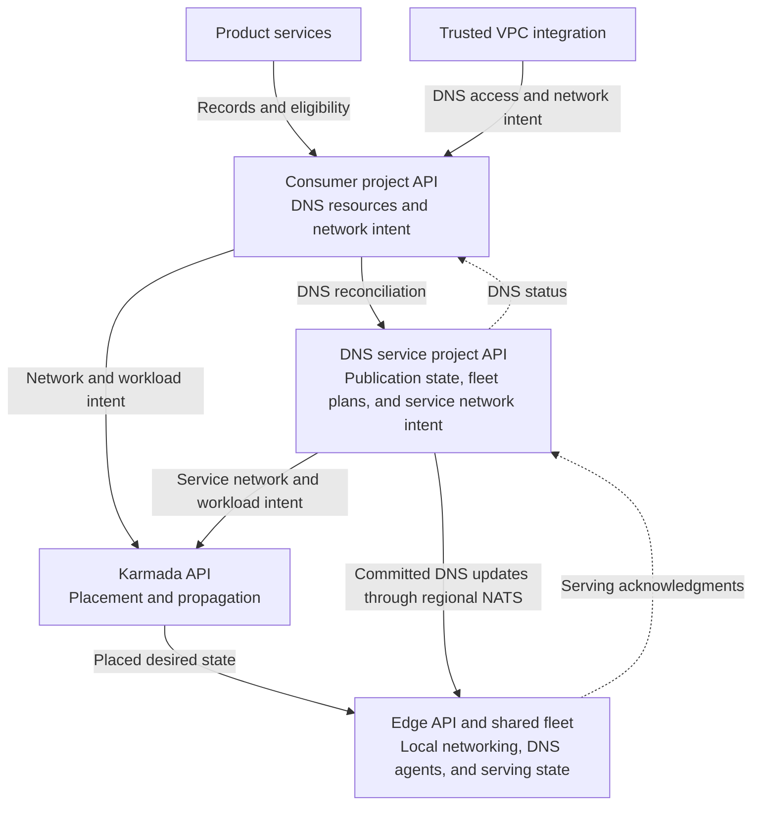
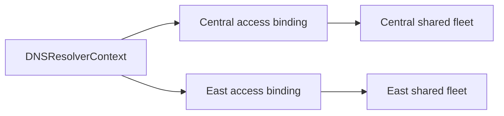
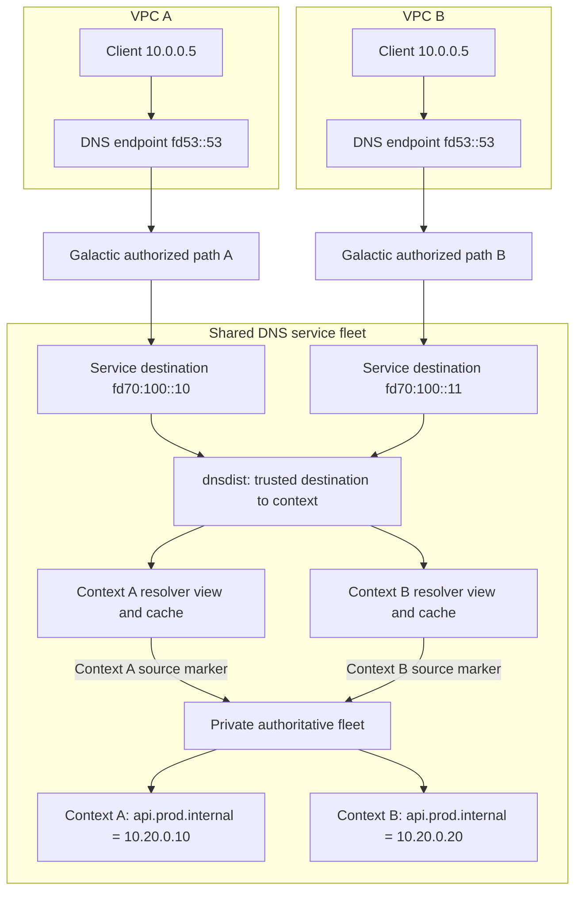
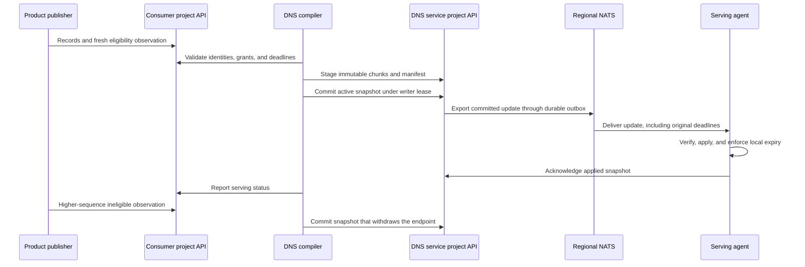

# Internal DNS architecture

- [Summary](#summary)
- [Motivation](#motivation)
  - [Goals](#goals)
  - [Non-Goals](#non-goals)
- [Proposal](#proposal)
  - [User stories](#user-stories)
  - [Notes, constraints, and caveats](#notes-constraints-and-caveats)
  - [Risks and mitigations](#risks-and-mitigations)
- [Design Details](#design-details)
  - [Control-plane boundaries](#control-plane-boundaries)
  - [Contexts and regional access](#contexts-and-regional-access)
  - [Query path and network identity](#query-path-and-network-identity)
  - [Publication and service discovery](#publication-and-service-discovery)
  - [API design](#api-design)
  - [Integration boundaries](#integration-boundaries)
- [Production Readiness Review Questionnaire](#production-readiness-review-questionnaire)
  - [Feature Enablement and Rollback](#feature-enablement-and-rollback)
  - [Rollout, Upgrade and Rollback Planning](#rollout-upgrade-and-rollback-planning)
  - [Monitoring Requirements](#monitoring-requirements)
  - [Dependencies](#dependencies)
  - [Scalability](#scalability)
  - [Troubleshooting](#troubleshooting)
- [Implementation History](#implementation-history)
- [Drawbacks](#drawbacks)
- [Alternatives](#alternatives)
- [Infrastructure Needed](#infrastructure-needed)

## Summary

Internal DNS lets resources resolve private names within a VPC. Each network has
a managed namespace and can use additional private zones. Product services
publish names automatically, and shared regional fleets serve many VPCs with
isolated DNS contexts.

The [product enhancement](https://github.com/datum-cloud/enhancements/pull/922)
defines the consumer experience. The
[Galactic design](https://github.com/datum-cloud/galactic/blob/main/docs/enhancements/networking/private-service-connect/README.md)
defines private connectivity. This enhancement defines the DNS architecture and
[API design](api-design.md).

## Motivation

Compute instances, Connect services, and other resources need names that resolve
within their network. Consumers should receive useful default names without
choosing a zone for every resource. Shared infrastructure must isolate networks
that use identical names and addresses, and stop returning endpoints that are no
longer eligible.

### Goals

- Serve private zones through the VPC's inherited resolver configuration.
- Allocate default names and support additional custom zones.
- Isolate overlapping names, addresses, and resolver caches across DNS contexts.
- Accept publications from distributed product control planes and withdraw
  expired or ineligible endpoints.
- Scale shared serving capacity across regions without deployments per VPC.

### Non-Goals

- Designing Galactic's private connectivity APIs or packet handling.
- Having DNS controllers inspect networking or product resources.
- Defining application health policies for product services.
- Changing public DNS behavior or defining cross-project zone sharing.

## Proposal

Trusted VPC integration provisions a DNS context and regional resolver access.
DNS allocates a managed namespace, accepts explicit custom zone associations,
and compiles product publications into private serving state. Consumers use a
stable resolver address in their VPC while the platform selects shared capacity.

### User stories

- A Compute user resolves an instance's default private hostname without
  selecting a zone or resolver deployment.
- A project adds `prod.internal` and uses names such as `api.prod.internal`.
- Two VPCs use the same zone name and resolver address but receive isolated
  answers. Removing an eligible endpoint withdraws its discovery address.

### Notes, constraints, and caveats

These contracts are proposed; API and serving qualification remain required.
Regional publication is asynchronous. Resolver access and endpoint eligibility
have separate deadlines. Client caches can retain an answer until its TTL
expires. Example addresses, identities, and allocated suffixes are illustrative.

### Risks and mitigations

- Tenant leakage: authorize network identity before cache lookup, isolate
  resolver views, and test overlapping zones and forged identities.
- Stale endpoints or access: preserve original deadlines, fence writers and
  replay, and enforce expiry locally at serving nodes.
- Shared fleet failure: qualify configuration activation, readiness, capacity,
  and regional failure handling before release.

## Design Details

### Control-plane boundaries

The DNS service runs in its own VPC. Galactic exposes it through a private
endpoint in each consumer VPC. The diagram shows which API owns each resource;
it does not prescribe where controller processes run.

- **Consumer project:** Owns private zones, records, associations, naming policies,
  registrations, grants, and contributions. Trusted VPC integration writes
  context and access specifications; DNS writes their status. Product services,
  such as Compute and Connect, publish their records and eligibility.
- **DNS service project:** Owns durable publication state, writer leases,
  allocation claims, regional serving plans, and the service's network intent.
- **Karmada:** Places network and workload intent at the edge. It is not the DNS
  publication store. Guest resolver settings must travel as desired state in the
  networking projection; source status is not a substitute for that contract.
- **Edge:** Owns local network contexts, interfaces, private endpoints, route
  policies, shared DNS workloads, and serving checkpoints.

DNS controllers use project discovery and authenticated project clients. They
do not watch VPCs, network interfaces, or product resources. VPC integration
translates networking authorization into DNS access. Product publishers translate
resource state into DNS records. These integrations keep networking and product
lifecycles outside the DNS controller.

### Contexts and regional access

A logical network has one DNS context across its locations. The context selects
its managed namespace and associated zones. Separate contexts can use identical
zone names and overlapping IP addresses. Sharing a zone requires an explicit
association.

Both access bindings live in the consumer project's control plane. `region`
selects a serving target; it does not select the API where the object lives.
Each binding has its own UID, trusted destination, authorization deadline, and
readiness. East access can expire while Central access remains available.

Publication reaches regions asynchronously. A region reports readiness after
its required serving members apply the current state. A failed region must not
block updates to healthy regions. Regional access does not, by itself, promise
that service discovery answers contain only endpoints from that region.

### Query path and network identity

Both VPCs can expose the same DNS address and contain the same client IP. Galactic
authorizes the private path and translates its destination into a distinct
service-side identity. DNS maps that identity to a context before consulting a
cache or selecting private zones.

Client source addresses, ECS, and client-supplied PROXY headers are not tenant
authority. Galactic checks the source VPC lifetime and route authorization before
translating the destination. A consumer must not be able to select another
context by addressing its service-side destination. Galactic handles the return
path to the consumer's DNS endpoint.

The serving candidate uses shared node and regional tiers:

1. **dnsdist** selects the context from the authorized destination. Its private
   packet cache is disabled.
2. **BIND resolver views** isolate positive and negative caches. Node views
   forward to context-specific regional destinations; regional views resolve
   private zones and provide recursive resolution for other names.
3. **PowerDNS Authoritative** serves private zone variants selected by
   service-owned source markers from the regional resolvers.

[dnsdist PROXYv2](https://www.dnsdist.org/advanced/passing-source-address.html)
preserves the destination when forwarding to a shared resolver listener.
[BIND's PROXY access controls](https://bind9.readthedocs.io/en/v9.20.2/reference.html#namedconf-statement-allow-proxy)
restrict that listener to approved service peers and listener addresses. Each
regional resolver replica uses a distinct marker for each context. A shared pool member
is eligible only when all its assigned contexts and authorizations are current.

[PowerDNS views](https://doc.powerdns.com/authoritative/views.html) are experimental
and require the LMDB backend and enabled zone cache. Unmatched clients bypass
view selection, and ordinary variantless zones are implicitly visible to views.
Therefore, private zones must have no variantless copy, and private authoritative
listeners must admit only approved resolver markers.

The original proposal called for PowerDNS Recursor at both resolver tiers. The
prototype has not qualified Recursor's cache isolation for this contract. BIND
views are the current candidate; PowerDNS Authoritative is a different component.
Replacing BIND requires positive and negative cache isolation tests against the
selected Recursor version. Adding a context changes shared configuration and
zone data, not the number of resolver processes.

### Publication and service discovery

A registration reserves a name and record types. A grant authorizes a product
publisher. A contribution supplies records and a time-limited eligibility
observation. DNS compiles accepted contributions into a complete zone snapshot.

Each zone has one logical compiler owner. Compare-and-swap updates to durable
ownership fence that writer. Takeover advances its epoch; revisions increase
within an epoch. Serving agents reject older epochs and revisions. Controller
leader election alone does not fence a writer after a partition.

Kubernetes API storage holds ownership, snapshots, and outboxes; this design
does not require Postgres. Regional exporters use
[NATS JetStream](https://docs.nats.io/nats-concepts/jetstream) for at-least-once
delivery. Every serving replica receives its complete assigned stream. The
exporter records an outbox before sending and reconciles committed snapshots
that lack an outbox after a crash. A broker acknowledgment confirms delivery to
the broker, not application by a DNS serving member. Queries use local state and
do not contact the broker or project APIs.

Products define eligibility for each record's purpose. An instance identity name
can follow interface readiness; service discovery can follow application health.
A stable service address can remain published while its backend membership
changes. DNS does not infer these policies from product APIs. User-authored
static records have no automatic endpoint health withdrawal.

Contribution freshness and resolver access have separate deadlines. Replay,
restart, or recompilation cannot extend either original deadline. Serving agents
withdraw expired contributions locally; a watchdog removes a member that cannot
enforce expiry. Deletions retain tombstones and writer fences for the supported
replay window.

A reserved name with no eligible addresses returns NODATA. An authorized context
whose required private state is unavailable returns SERVFAIL; an unknown or
expired access identity returns REFUSED. Missing private state must never fall
back to public resolution. Dynamic TTLs are bounded, and stale private answers
are disabled. Withdrawal budgets include publication delay, local expiry, and
client cache TTL: removing a served record cannot erase an answer already cached
by a client.

### API design

The [API design](api-design.md) provides YAML examples with field comments for
contexts, regional access, private zones, associations, naming policies,
registrations, grants, contributions, and DNS-owned publication state. It also
defines writer ownership, validation, and prototype compatibility boundaries.

### Integration boundaries

Reuse project discovery, authenticated project clients, record types, condition
patterns, certificates, release tooling, and PowerDNS/LMDB operating experience.
The [infra configuration](https://github.com/datum-cloud/infra/tree/main/apps/dns-operator)
provides these integration points; its public serving and replication paths do
not establish private tenant isolation.

New components include private API admission, context allocation, publication
ownership and compilation, durable export, shared fleet configuration, and
serving acknowledgments. Private snapshots need their own activation contract;
public zone replication through LightningStream does not replace it.

## Production Readiness Review Questionnaire

Production readiness review remains open. Resolve the following requirements
before release.

### Feature Enablement and Rollback

Alpha needs separate activation controls for product publication and private
serving. Flag names and deployment wiring require implementation review. Public
visibility remains the default. Rollback must revoke consumer access before
draining private serving capacity; workloads that depend on internal DNS lose
resolution. Reenabling requires fresh authorizations and observations, with
retained writer fences preventing stale replay.

### Rollout, Upgrade and Rollback Planning

Deploy shared capacity before granting access, then qualify a limited set of
contexts and expand by region. Validate overlapping zones and addresses,
positive and negative cache isolation, forged identities, UDP and TCP, access
revocation, endpoint withdrawal, writer failover, replay, restart, API and broker
outages, and partial regional failure. Include Galactic's private path and guest
resolver configuration. Upgrade, rollback, and reenabling tests remain release
requirements. Resolve withdrawal budgets and tombstone retention before rollout.

### Monitoring Requirements

Measure query latency and failures, publication lag, outbox backlog, expiry
withdrawal delay, failed activations, and watchdog removal of serving members.
Keep metric labels bounded; use resource status for context-level diagnosis.
Consumers inspect access readiness and published names, then query from their
VPC. Query availability, latency, and withdrawal SLOs require measured targets
before release.

### Dependencies

- Project APIs and discovery support intent, renewal, and durable coordination.
  An outage stops updates; installed state remains subject to its deadlines.
- Galactic and Karmada provide authorized private paths and placed network and
  workload intent. Network authorization expires independently of DNS state.
- NATS JetStream carries committed updates. Outages delay publication; queries
  continue from local state while original freshness deadlines still apply.
- dnsdist, BIND, and PowerDNS Authoritative provide query serving. Versions and
  configuration must pass the tenant isolation qualification described above.

### Scalability

API traffic includes project watches, eligibility and access renewals, compiler
leases, snapshot writes, export progress, and serving acknowledgments. Bound
snapshot chunks and retained history. Contexts add views, addresses, and zone
data to shared processes. Measure API write rates, cache memory, configuration
reload time, transport fanout, and query throughput at the expected context
count. Supported limits and regional failover capacity remain open decisions.

### Troubleshooting

Trace project, context, and access UIDs through the accepted authorization,
committed manifest epoch and revision, and serving acknowledgments. For REFUSED,
inspect access expiry and the authorized network destination. For SERVFAIL,
inspect missing private state and serving readiness. For NODATA, inspect product
eligibility and contribution deadlines. During API or broker outages, inspect
outbox lag and local expiry; replay must not renew stale state.

## Implementation History

- 2026-10-08: [DNS operator #229](https://github.com/datum-cloud/dns-operator/pull/229)
  proposes the DNS architecture and annotated API contracts.
- 2026-10-08: [DNS operator #230](https://github.com/datum-cloud/dns-operator/pull/230)
  proposes the private-zone visibility boundary. The complete feature remains
  under development.

## Drawbacks

Shared view configuration and experimental authoritative views add operational
complexity. Deadline enforcement, distributed writer fencing, and durable
publication introduce coordination state and ongoing API traffic. A fleet
failure can affect many contexts, so capacity and activation need qualification.

## Alternatives

- **PowerDNS Recursor:** The original resolver choice. Replacing BIND remains an
  option after qualifying positive and negative cache isolation for the selected
  version.
- **CoreDNS:** An alternative serving component that needs a tenant-aware query
  and cache design, plus throughput and operational qualification.
- **Resolvers per VPC:** Provide separate processes but conflict with the shared
  fleet requirement and add workload overhead for every network.
- **DNS reads product and networking APIs:** Avoids publisher integrations but
  couples DNS to their lifecycles and health policies. Explicit publications and
  opaque contexts keep those responsibilities with their owners.

## Infrastructure Needed

Provide a DNS service VPC, Galactic private connectivity, shared node and regional
serving capacity, protected destination and source-marker allocation, durable
project API storage, and secured NATS JetStream capacity. Reuse platform identity,
certificates, and deployment tooling. Regional broker placement, capacity, and
failover policy need review before production deployment.
