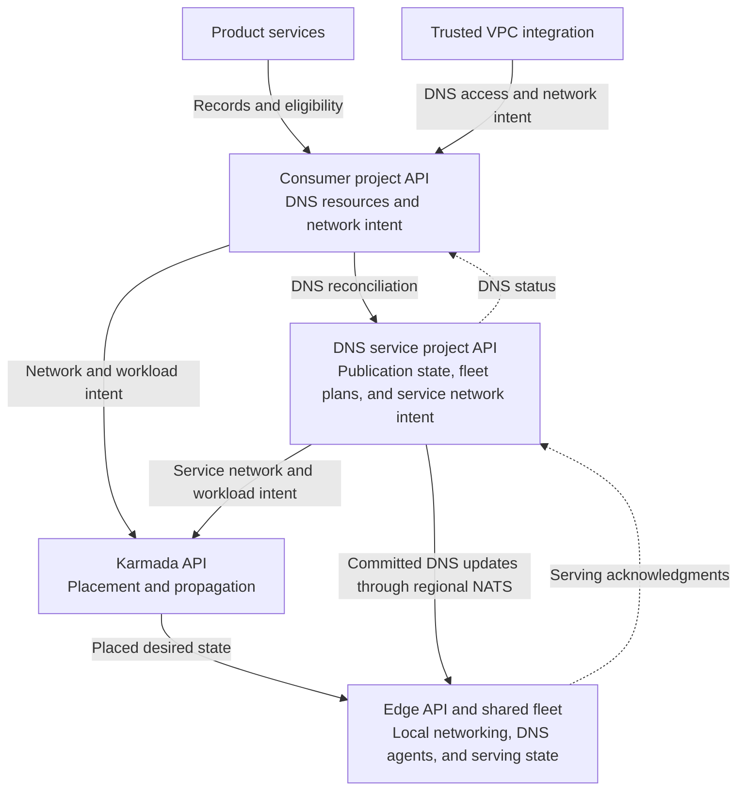
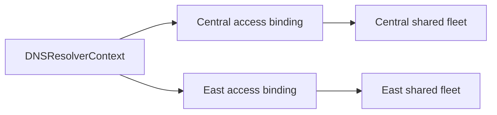
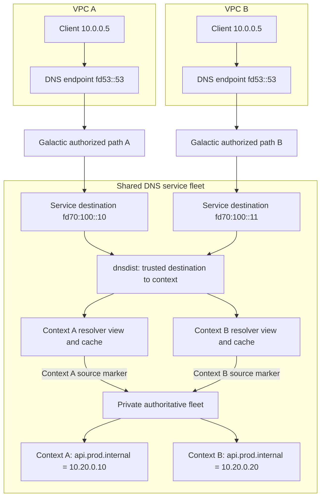
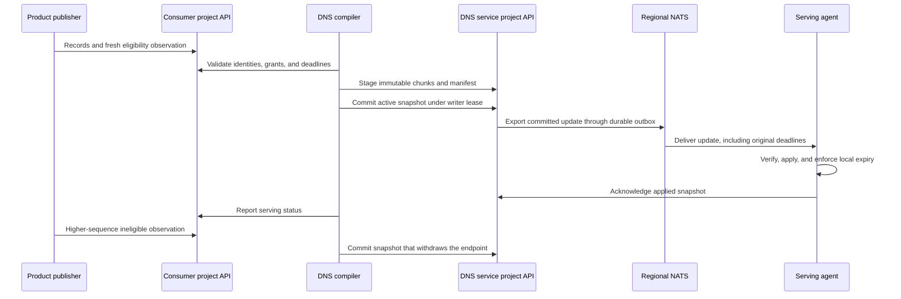

# Internal DNS architecture

- [Summary](#summary)
- [Motivation](#motivation)
  - [Goals](#goals)
  - [Non-Goals](#non-goals)
- [Proposal](#proposal)
  - [User stories](#user-stories)
  - [Notes, constraints, and caveats](#notes-constraints-and-caveats)
  - [Risks and mitigations](#risks-and-mitigations)
- [Design Details](#design-details)
  - [Control-plane boundaries](#control-plane-boundaries)
  - [Contexts and regional access](#contexts-and-regional-access)
  - [Query path and network identity](#query-path-and-network-identity)
  - [Publication and service discovery](#publication-and-service-discovery)
  - [API design](#api-design)
    - [Ownership and validation](#ownership-and-validation)
    - [Context and regional access](#context-and-regional-access)
    - [Private zones and associations](#private-zones-and-associations)
    - [Automatic naming and additional names](#automatic-naming-and-additional-names)
    - [Product publication](#product-publication)
    - [DNS service project contracts](#dns-service-project-contracts)
    - [Compatibility and API review](#compatibility-and-api-review)
  - [Integration boundaries](#integration-boundaries)
- [Production Readiness Review Questionnaire](#production-readiness-review-questionnaire)
  - [Feature Enablement and Rollback](#feature-enablement-and-rollback)
  - [Rollout, Upgrade and Rollback Planning](#rollout-upgrade-and-rollback-planning)
  - [Monitoring Requirements](#monitoring-requirements)
  - [Dependencies](#dependencies)
  - [Scalability](#scalability)
  - [Troubleshooting](#troubleshooting)
- [Implementation History](#implementation-history)
- [Drawbacks](#drawbacks)
- [Alternatives](#alternatives)
- [Infrastructure Needed](#infrastructure-needed)

## Summary

Internal DNS lets resources resolve private names within a VPC. Each network has
a managed namespace and can use additional private zones. Product services
publish names automatically, and shared regional fleets serve many VPCs with
isolated DNS contexts.

The [product enhancement](https://github.com/datum-cloud/enhancements/pull/922)
defines the consumer experience. The
[Galactic design](https://github.com/datum-cloud/galactic/blob/main/docs/enhancements/networking/private-service-connect/README.md)
defines private connectivity. This enhancement defines the DNS architecture and
[API design](#api-design).

## Motivation

Compute instances, Connect services, and other resources need names that resolve
within their network. Consumers should receive useful default names without
choosing a zone for every resource. Shared infrastructure must isolate networks
that use identical names and addresses, and stop returning endpoints that are no
longer eligible.

### Goals

- Serve private zones through the VPC's inherited resolver configuration.
- Allocate default names and support additional custom zones.
- Isolate overlapping names, addresses, and resolver caches across DNS contexts.
- Accept publications from distributed product control planes and withdraw
  expired or ineligible endpoints.
- Scale shared serving capacity across regions without deployments per VPC.

### Non-Goals

- Designing Galactic's private connectivity APIs or packet handling.
- Having DNS controllers inspect networking or product resources.
- Defining application health policies for product services.
- Changing public DNS behavior or defining cross-project zone sharing.

## Proposal

Trusted VPC integration provisions a DNS context and regional resolver access.
DNS allocates a managed namespace, accepts explicit custom zone associations,
and compiles product publications into private serving state. Consumers use a
stable resolver address in their VPC while the platform selects shared capacity.

### User stories

- A Compute user resolves an instance's default private hostname without
  selecting a zone or resolver deployment.
- A project adds `prod.internal` and uses names such as `api.prod.internal`.
- Two VPCs use the same zone name and resolver address but receive isolated
  answers. Removing an eligible endpoint withdraws its discovery address.

### Notes, constraints, and caveats

These contracts are proposed; API and serving qualification remain required.
Regional publication is asynchronous. Resolver access and endpoint eligibility
have separate deadlines. Client caches can retain an answer until its TTL
expires. Example addresses, identities, and allocated suffixes are illustrative.

### Risks and mitigations

- Tenant leakage: authorize network identity before cache lookup, isolate
  resolver views, and test overlapping zones and forged identities.
- Stale endpoints or access: preserve original deadlines, fence writers and
  replay, and enforce expiry locally at serving nodes.
- Shared fleet failure: qualify configuration activation, readiness, capacity,
  and regional failure handling before release.

## Design Details

### Control-plane boundaries

The DNS service runs in its own VPC. Galactic exposes it through a private
endpoint in each consumer VPC. The diagram shows which API owns each resource;
it does not prescribe where controller processes run.



- **Consumer project:** Owns private zones, records, associations, naming policies,
  registrations, grants, and contributions. Trusted VPC integration writes
  context and access specifications; DNS writes their status. Product services,
  such as Compute and Connect, publish their records and eligibility.
- **DNS service project:** Owns durable publication state, writer leases,
  allocation claims, regional serving plans, and the service's network intent.
- **Karmada:** Places network and workload intent at the edge. It is not the DNS
  publication store. Guest resolver settings must travel as desired state in the
  networking projection; source status is not a substitute for that contract.
- **Edge:** Owns local network contexts, interfaces, private endpoints, route
  policies, shared DNS workloads, and serving checkpoints.

DNS controllers use project discovery and authenticated project clients. They
do not watch VPCs, network interfaces, or product resources. VPC integration
translates networking authorization into DNS access. Product publishers translate
resource state into DNS records. These integrations keep networking and product
lifecycles outside the DNS controller.

### Contexts and regional access

A logical network has one DNS context across its locations. The context selects
its managed namespace and associated zones. Separate contexts can use identical
zone names and overlapping IP addresses. Sharing a zone requires an explicit
association.



Both access bindings live in the consumer project's control plane. `region`
selects a serving target; it does not select the API where the object lives.
Each binding has its own UID, trusted destination, authorization deadline, and
readiness. East access can expire while Central access remains available.

Publication reaches regions asynchronously. A region reports readiness after
its required serving members apply the current state. A failed region must not
block updates to healthy regions. Regional access does not, by itself, promise
that service discovery answers contain only endpoints from that region.

### Query path and network identity

Both VPCs can expose the same DNS address and contain the same client IP. Galactic
authorizes the private path and translates its destination into a distinct
service-side identity. DNS maps that identity to a context before consulting a
cache or selecting private zones.



Client source addresses, ECS, and client-supplied PROXY headers are not tenant
authority. Galactic checks the source VPC lifetime and route authorization before
translating the destination. A consumer must not be able to select another
context by addressing its service-side destination. Galactic handles the return
path to the consumer's DNS endpoint.

The serving candidate uses shared node and regional tiers:

1. **dnsdist** selects the context from the authorized destination. Its private
   packet cache is disabled.
2. **BIND resolver views** isolate positive and negative caches. Node views
   forward to context-specific regional destinations; regional views resolve
   private zones and provide recursive resolution for other names.
3. **PowerDNS Authoritative** serves private zone variants selected by
   service-owned source markers from the regional resolvers.

[dnsdist PROXYv2](https://www.dnsdist.org/advanced/passing-source-address.html)
preserves the destination when forwarding to a shared resolver listener.
[BIND's PROXY access controls](https://bind9.readthedocs.io/en/v9.20.2/reference.html#namedconf-statement-allow-proxy)
restrict that listener to approved service peers and listener addresses. Each
regional resolver replica uses a distinct marker for each context. A shared pool member
is eligible only when all its assigned contexts and authorizations are current.

[PowerDNS views](https://doc.powerdns.com/authoritative/views.html) are experimental
and require the LMDB backend and enabled zone cache. Unmatched clients bypass
view selection, and ordinary variantless zones are implicitly visible to views.
Therefore, private zones must have no variantless copy, and private authoritative
listeners must admit only approved resolver markers.

The original proposal called for PowerDNS Recursor at both resolver tiers. The
prototype has not qualified Recursor's cache isolation for this contract. BIND
views are the current candidate; PowerDNS Authoritative is a different component.
Replacing BIND requires positive and negative cache isolation tests against the
selected Recursor version. Adding a context changes shared configuration and
zone data, not the number of resolver processes.

### Publication and service discovery

A registration reserves a name and record types. A grant authorizes a product
publisher. A contribution supplies records and a time-limited eligibility
observation. DNS compiles accepted contributions into a complete zone snapshot.



Each zone has one logical compiler owner. Compare-and-swap updates to durable
ownership fence that writer. Takeover advances its epoch; revisions increase
within an epoch. Serving agents reject older epochs and revisions. Controller
leader election alone does not fence a writer after a partition.

Kubernetes API storage holds ownership, snapshots, and outboxes; this design
does not require Postgres. Regional exporters use
[NATS JetStream](https://docs.nats.io/nats-concepts/jetstream) for at-least-once
delivery. Every serving replica receives its complete assigned stream. The
exporter records an outbox before sending and reconciles committed snapshots
that lack an outbox after a crash. A broker acknowledgment confirms delivery to
the broker, not application by a DNS serving member. Queries use local state and
do not contact the broker or project APIs.

Products define eligibility for each record's purpose. An instance identity name
can follow interface readiness; service discovery can follow application health.
A stable service address can remain published while its backend membership
changes. DNS does not infer these policies from product APIs. User-authored
static records have no automatic endpoint health withdrawal.

Contribution freshness and resolver access have separate deadlines. Replay,
restart, or recompilation cannot extend either original deadline. Serving agents
withdraw expired contributions locally; a watchdog removes a member that cannot
enforce expiry. Deletions retain tombstones and writer fences for the supported
replay window.

A reserved name with no eligible addresses returns NODATA. An authorized context
whose required private state is unavailable returns SERVFAIL; an unknown or
expired access identity returns REFUSED. Missing private state must never fall
back to public resolution. Dynamic TTLs are bounded, and stale private answers
are disabled. Withdrawal budgets include publication delay, local expiry, and
client cache TTL: removing a served record cannot erase an answer already cached
by a client.

### API design

All examples use `dns.networking.miloapis.com/v1alpha1`. The project API assigns
object UIDs and generations. Reference UIDs, timestamps, addresses, and allocated
suffixes below are illustrative. `status` examples show controller output and
are not fields consumers submit when creating resources.

#### Ownership and validation

- Trusted VPC integration creates resolver contexts and regional access bindings.
  DNS allocates managed namespaces and reports serving status.
- Project users manage custom private zones, associations, static records, and
  naming policy. Platform policy controls namespace reservations and grants.
- Product publishers write contribution records and eligibility. They cannot
  authorize resolver access, grant themselves publication rights, or write DNS
  service project state.
- DNS owns grant epochs, publication revisions, serving plans, and acknowledgments.
  Admission must enforce field ownership, including fields sharing a status
  subresource; RBAC on that subresource alone is insufficient.

New references pin API-assigned UIDs. References that authorize publication also
pin the policy generation. The authenticated project and source-cluster identity
scope each reference; resource names and self-reported cluster IDs are not
credentials. Cross-project references are outside this proposal.

#### Context and regional access

VPC integration creates an opaque DNS scope. DNS does not dereference the
`consumerID` or watch a networking resource.

```yaml
apiVersion: dns.networking.miloapis.com/v1alpha1
kind: DNSResolverContext
metadata:
  name: application
spec:
  # Immutable lifetime identity supplied by trusted VPC integration.
  consumerID: "11111111-1111-4111-8111-111111111111/22222222-2222-4222-8222-222222222222"
  # Allocate a default private namespace without asking users to choose a zone.
  managedNamespace:
    enabled: true
status:
  # DNS-owned output; publishers use this allocated zone and suffix.
  managedNamespace:
    dnsZoneRef:
      name: managed-application
      uid: 44444444-4444-4444-8444-444444444444
    suffix: vpc-a7c9.project-p4e2.internal
  # DNS-owned fencing epoch for trusted access authorization.
  accessWriterEpoch: 3
  # Regional assignments do not move this object out of the project API.
  servingTargets:
    - region: central
      shard: shared-0
---
apiVersion: dns.networking.miloapis.com/v1alpha1
kind: DNSResolverAccessBinding
metadata:
  name: application-central
spec:
  # Pin the context lifetime so recreation cannot inherit old access.
  contextRef:
    name: application
    uid: 33333333-3333-4333-8333-333333333333
  # Select the serving region, not a separate project control plane.
  region: central
  queryIdentity:
    # Galactic supplies an authorized service-side destination before DNS lookup.
    type: DestinationAddress
    # This is distinct from the well-known address exposed inside the VPC.
    value: fd70:100::10
  # Permit DNS over both transports at the authorized destination.
  port: 53
  transports: [UDP, TCP]
  authorization:
    # Match the DNS-issued context epoch; stale issuers cannot restore access.
    writerEpoch: 3
    # Renewals advance monotonically within this access-binding lifetime.
    sequence: 27
    # Preserve this deadline through transport, replay, and local installation.
    validUntil: "2026-10-08T20:05:00Z"
```

The context reports `Ready` when its namespace and assignment are available.
An access binding reports `Accepted` after authorization validation and `Ready`
after the required serving members apply current access and configuration.
`status.observedSequence` identifies the authorization renewal DNS has observed;
`status.bindingRef` identifies the DNS-owned serving plan.

Context, region, query identity, port, transports, and authorization epoch are
immutable for an access-binding lifetime. Renewals advance the sequence with a
bounded deadline. Destinations must be unique within their routing scope. A
second region gets another binding against the same context. Galactic owns the
consumer-side address, private route, and network lease separately.

#### Private zones and associations

Users can add a custom zone to the context and create static records in it.
Private zones do not require public domain verification or public delegation.

```yaml
apiVersion: dns.networking.miloapis.com/v1alpha1
kind: DNSZone
metadata:
  name: production
spec:
  # Visibility is immutable. The existing default remains Public.
  visibility: Private
  # Different contexts can associate separate zones with this same apex.
  domainName: prod.internal
  # Select private backend policy; users do not choose fleet instances.
  dnsZoneClassName: datum-internal-dns
---
apiVersion: dns.networking.miloapis.com/v1alpha1
kind: DNSZoneAssociation
metadata:
  name: production-application
spec:
  # Both objects belong to this project. Pin each object's lifetime.
  dnsZoneRef:
    name: production
    uid: 88888888-8888-4888-8888-888888888888
  # DNS consumes a context reference, not a VPC reference.
  resolverContextRef:
    name: application
    uid: 33333333-3333-4333-8333-333333333333
---
apiVersion: dns.networking.miloapis.com/v1alpha1
kind: DNSRecordSet
metadata:
  name: database
spec:
  # Existing record API: a same-project name reference to its zone.
  dnsZoneRef:
    name: production
  recordType: A
  records:
    # Static records have no endpoint eligibility lease.
    - name: database
      ttl: 30
      a:
        content: 10.20.0.50
```

A context can associate several zones, including its managed zone. Associating
two different zones with the same apex to one context is rejected. Parent and
child zones require deterministic longest-suffix selection. Two contexts can
share one zone through explicit associations, or associate separate zones with
the same apex for isolated answers. Admission must also reject conflicts
between static records and reserved registration names.

#### Automatic naming and additional names

DNS owns the lifecycle of the managed namespace and its association. Publishers
read its zone reference from context status. A DNS-owned `DNSManagedNamespace`
can track allocation and cleanup; consumers should not need to create it.

A naming policy adds names in custom zones. It supplements the managed name and
does not require a zone choice on each Compute or Connect resource.

```yaml
apiVersion: dns.networking.miloapis.com/v1alpha1
kind: DNSNamingPolicy
metadata:
  name: application-production-names
spec:
  # Apply naming rules to this DNS scope.
  resolverContextRef:
    name: application
    uid: 33333333-3333-4333-8333-333333333333
  additionalNames:
    # Add instance identity names, such as web-01.instances.prod.internal.
    - registrationClass: InstanceIdentity
      dnsZoneRef:
        name: production
        uid: 88888888-8888-4888-8888-888888888888
      namePrefix: instances
    # Add discovery names, such as api.services.prod.internal.
    - registrationClass: ServiceDiscovery
      dnsZoneRef:
        name: production
        uid: 88888888-8888-4888-8888-888888888888
      namePrefix: services
```

Every target zone must be associated with the context. The proposed classes are
`InstanceIdentity`, `ServiceDiscovery`, `ServiceVIP`, and `ServiceExport`.
Product integrations apply the appropriate rule when reserving names. DNS does
not inspect the underlying product resource to determine its class.

#### Product publication

Compute can reserve a name in the managed namespace, obtain a scoped publisher
grant, and publish eligible interface addresses. Connect uses the same contract
with its own publisher principal and export eligibility policy.

```yaml
apiVersion: dns.networking.miloapis.com/v1alpha1
kind: DNSRegistration
metadata:
  name: instance-web-01
spec:
  # Select the managed zone allocated for the resource's DNS context.
  dnsZoneRef:
    name: managed-application
    uid: 44444444-4444-4444-8444-444444444444
  # Reserve this relative owner name, rather than one particular IP address.
  name: web-01.instances
  # Constrain which record types contributions can populate.
  recordTypes: [A, AAAA]
  # Publish only contributions with a current eligible observation.
  publicationPolicy: EligibleContributions
  # Bound client caching; this does not replace the observation deadline.
  ttlSeconds: 30
  # Optional descendant reservations must not overlap other owners.
  reservedDescendants: []
status:
  # DNS-owned output for product status and consumer display.
  canonicalFQDN: web-01.instances.vpc-a7c9.project-p4e2.internal
---
apiVersion: dns.networking.miloapis.com/v1alpha1
kind: DNSContributionGrant
metadata:
  name: web-01-compute
spec:
  # Pin both the registration lifetime and the policy being authorized.
  registrationRef:
    name: instance-web-01
    uid: 55555555-5555-4555-8555-555555555555
    generation: 1
  # Audit label; the authenticated principal below authorizes the writer.
  producerID: compute
  principal:
    # Trusted source-cluster identity distinguishes distributed publishers.
    clusterUID: 99999999-9999-4999-8999-999999999999
    subject: system:serviceaccount:compute-system:dns-publisher
  # Scope the writer to these types and owner names.
  recordTypes: [A, AAAA]
  nameScopes: [web-01.instances]
status:
  # DNS allocates the epoch; the producer cannot choose its own fencing token.
  activeWriterEpoch: 3
  # Identify the grant and registration policy versions DNS accepted.
  observedGrantGeneration: 1
  observedRegistrationGeneration: 1
---
apiVersion: dns.networking.miloapis.com/v1alpha1
kind: DNSRecordContribution
metadata:
  name: web-01-endpoint
spec:
  # Bind the contribution to the reserved name and its current policy.
  registrationRef:
    name: instance-web-01
    uid: 55555555-5555-4555-8555-555555555555
    generation: 1
  # Bind the producer to its authorized grant lifetime and policy.
  grantRef:
    name: web-01-compute
    uid: 66666666-6666-4666-8666-666666666666
    generation: 1
  # Reuse the existing typed record representation.
  recordSets:
    - recordType: A
      records:
        - name: web-01.instances
          ttl: 30
          a:
            content: 10.20.0.10
    - recordType: AAAA
      records:
        - name: web-01.instances
          ttl: 30
          aaaa:
            content: fd20::10
status:
  # Producer-owned: this observation covers the current contribution spec.
  observedGeneration: 1
  # Producer-owned: echo the DNS-issued grant epoch.
  writerEpoch: 3
  # Producer-owned: order observations within that epoch.
  sequence: 18
  # Producer-owned: product policy determines readiness for this name's purpose.
  eligible: true
  reason: NetworkInterfaceProgrammed
  # Producer-owned: DNS must preserve this original freshness deadline.
  validUntil: "2026-10-08T20:01:00Z"
  # DNS-owned: the publication revision that included this contribution.
  publishedRevision: 12
```

Status updates use the current resource version and preserve fields owned by
other controllers. Changing contribution records requires an observation for
the new generation. Admission verifies the authenticated principal, pinned
references, accepted grant epoch, increasing sequence, permitted records, and
bounded freshness interval.

When an endpoint becomes ineligible, its publisher submits a higher-sequence
observation with `eligible: false`. DNS withdraws its addresses through the same
publication path. If the publisher disappears, the original deadline still
expires locally. Recovery requires a fresh eligible observation; replaying the
old one does not restore an endpoint. The product defines whether interface
readiness, application health, or another condition determines eligibility.

The prototype also defines `Persistent`, but its distinct lifetime semantics
need API review. Use `DNSRecordSet` for static records in this proposal.

#### DNS service project contracts

These resources are internal to the DNS service project. Consumers and product
publishers cannot write them. Examples show selected fields that explain
coordination; they are not complete generated serving plans or transport payloads.

```yaml
apiVersion: dns.networking.miloapis.com/v1alpha1
kind: DNSResolverBinding
metadata:
  name: application-central
  namespace: dns-platform
spec:
  # Preserve the authenticated source project identity in shared storage.
  projectUID: 11111111-1111-4111-8111-111111111111
  # Prototype wire name: this carries a DNS context UID, not a VPC lookup key.
  vpcUID: 33333333-3333-4333-8333-333333333333
  # Identify the shared regional serving assignment.
  region: central
  shard: shared-0
  # Fence plan replacement separately from configuration changes.
  bindingGeneration: 1
  configurationRevision: 7
  # Trusted node-tier and regional-tier destinations for this context.
  consumerAddress: fd70:100::10
  clusterAddress: fd70:200::10
  port: 53
  transports: [UDP, TCP]
  # Use isolated caches in shared processes, with no private dnsdist packet cache.
  resolverEngine: BIND9
  resolverIsolation: View
  deploymentModel: SharedShard
  dnsdistPacketCache: Disabled
  # Only explicitly associated private zones enter the context's plan.
  zoneUIDs:
    - 44444444-4444-4444-8444-444444444444
    - 88888888-8888-4888-8888-888888888888
  # Preserve the accepted access authorization through every serving tier.
  authorizationIssuerEpoch: 3
  authorizationRevision: 27
  authorizationValidUntil: "2026-10-08T20:05:00Z"
```

The publication resources divide coordination from immutable data:

- `DNSPublicationOwnership` holds the zone's compiler lease, writer epoch,
  revision allocator, and active manifest pointer. Updates use compare-and-swap.
- `DNSPublicationChunk` holds a bounded part of a snapshot with its index, epoch,
  revision, hash, and payload. Chunks are immutable.
- `DNSPublicationManifest` identifies the complete snapshot, its chunks,
  serving targets, and original contribution deadlines.
- `DNSTransportOutbox` records a committed update's subject, identity, hash,
  payload, and dependencies before sending. Ambiguous retries reuse the same
  event identity. Transport acknowledgment is separate from serving acknowledgment.

```yaml
apiVersion: dns.networking.miloapis.com/v1alpha1
kind: DNSPublicationOwnership
metadata:
  name: managed-zone-owner
  namespace: dns-platform
spec:
  # One logical compiler owner per zone lifetime.
  zoneUID: 44444444-4444-4444-8444-444444444444
  # Identify the current controller lease holder.
  holderIdentity: compiler-a
  # Takeover increases the epoch; revisions increase within it.
  writerEpoch: 2
  nextRevision: 13
  # A writer must hold a current lease to commit the active pointer.
  leaseUntil: "2026-10-08T20:01:00Z"
  # The committed snapshot is the activation authority.
  activeManifestName: managed-zone-e2-r12
---
apiVersion: dns.networking.miloapis.com/v1alpha1
kind: DNSPublicationManifest
metadata:
  name: managed-zone-e2-r12
  namespace: dns-platform
spec:
  # Retain the source zone lifetime and its private apex.
  zoneRef:
    name: managed-application
    uid: 44444444-4444-4444-8444-444444444444
  zoneApex: vpc-a7c9.project-p4e2.internal
  # Select this zone's private authoritative variant.
  variant: zone-44444444
  # Prototype wire name: values are DNS context UIDs, not networking references.
  vpcUIDs:
    - 33333333-3333-4333-8333-333333333333
  # Agents reject snapshots behind their accepted writer fence.
  writerEpoch: 2
  revision: 12
  previousRevision: 11
  # Deletion uses a fenced tombstone rather than silently dropping history.
  tombstone: false
  # Verify all chunks before activation; these hashes are illustrative.
  chunks:
    - name: managed-zone-e2-r12-c0
      sha256: aaaaaaaaaaaaaaaaaaaaaaaaaaaaaaaaaaaaaaaaaaaaaaaaaaaaaaaaaaaaaaaa
      size: 512
  contentHash: bbbbbbbbbbbbbbbbbbbbbbbbbbbbbbbbbbbbbbbbbbbbbbbbbbbbbbbbbbbbbbbb
  generatedAt: "2026-10-08T20:00:00Z"
  contributionFences:
    # Original observation deadlines survive recompilation and replay.
    - uid: 77777777-7777-4777-8777-777777777777
      grantUID: 66666666-6666-4666-8666-666666666666
      epoch: 3
      sequence: 18
      validUntil: "2026-10-08T20:01:00Z"
  # Each required replica receives the complete regional assignment.
  servingTargets:
    - region: central
      shard: shared-0
```

The compiler stages immutable chunks and a manifest, then commits the active
pointer under its current ownership lease. Exporters reconcile that pointer and
repair a missing outbox after a crash. Agents verify identities, hashes, writer
fences, and deadlines before applying a complete snapshot. Acknowledgments must
identify the exact binding or zone lifetime, epoch, and revision applied.
Serving agents retain fences for expired, withdrawn, and deleted state so an
older replay cannot restore it.

#### Compatibility and API review

The target integration uses `resolverContextRef` and never requires DNS to read
networking resources. The prototype retains legacy `vpcRef` inputs and internal
`vpcUID`/`vpcUIDs` wire names. Context-based execution treats the latter as opaque
DNS context identities. Rename these internal fields and define migration rules
before stabilizing the API; do not make the old VPC coupling a supported contract.

API review must settle namespace reservation policy, naming conflicts, grant
issuance and revocation, field-level status ownership, deadline bounds, regional
readiness aggregation, snapshot size limits, and the complete internal serving
plan schema. Private visibility and exclusion from public controllers form a
separate implementation boundary in
[DNS operator #230](https://github.com/datum-cloud/dns-operator/pull/230).

### Integration boundaries

Reuse project discovery, authenticated project clients, record types, condition
patterns, certificates, release tooling, and PowerDNS/LMDB operating experience.
The [infra configuration](https://github.com/datum-cloud/infra/tree/main/apps/dns-operator)
provides these integration points; its public serving and replication paths do
not establish private tenant isolation.

New components include private API admission, context allocation, publication
ownership and compilation, durable export, shared fleet configuration, and
serving acknowledgments. Private snapshots need their own activation contract;
public zone replication through LightningStream does not replace it.

## Production Readiness Review Questionnaire

Production readiness review remains open. Resolve the following requirements
before release.

### Feature Enablement and Rollback

Alpha needs separate activation controls for product publication and private
serving. Flag names and deployment wiring require implementation review. Public
visibility remains the default. Rollback must revoke consumer access before
draining private serving capacity; workloads that depend on internal DNS lose
resolution. Reenabling requires fresh authorizations and observations, with
retained writer fences preventing stale replay.

### Rollout, Upgrade and Rollback Planning

Deploy shared capacity before granting access, then qualify a limited set of
contexts and expand by region. Validate overlapping zones and addresses,
positive and negative cache isolation, forged identities, UDP and TCP, access
revocation, endpoint withdrawal, writer failover, replay, restart, API and broker
outages, and partial regional failure. Include Galactic's private path and guest
resolver configuration. Upgrade, rollback, and reenabling tests remain release
requirements. Resolve withdrawal budgets and tombstone retention before rollout.

### Monitoring Requirements

Measure query latency and failures, publication lag, outbox backlog, expiry
withdrawal delay, failed activations, and watchdog removal of serving members.
Keep metric labels bounded; use resource status for context-level diagnosis.
Consumers inspect access readiness and published names, then query from their
VPC. Query availability, latency, and withdrawal SLOs require measured targets
before release.

### Dependencies

- Project APIs and discovery support intent, renewal, and durable coordination.
  An outage stops updates; installed state remains subject to its deadlines.
- Galactic and Karmada provide authorized private paths and placed network and
  workload intent. Network authorization expires independently of DNS state.
- NATS JetStream carries committed updates. Outages delay publication; queries
  continue from local state while original freshness deadlines still apply.
- dnsdist, BIND, and PowerDNS Authoritative provide query serving. Versions and
  configuration must pass the tenant isolation qualification described above.

### Scalability

API traffic includes project watches, eligibility and access renewals, compiler
leases, snapshot writes, export progress, and serving acknowledgments. Bound
snapshot chunks and retained history. Contexts add views, addresses, and zone
data to shared processes. Measure API write rates, cache memory, configuration
reload time, transport fanout, and query throughput at the expected context
count. Supported limits and regional failover capacity remain open decisions.

### Troubleshooting

Trace project, context, and access UIDs through the accepted authorization,
committed manifest epoch and revision, and serving acknowledgments. For REFUSED,
inspect access expiry and the authorized network destination. For SERVFAIL,
inspect missing private state and serving readiness. For NODATA, inspect product
eligibility and contribution deadlines. During API or broker outages, inspect
outbox lag and local expiry; replay must not renew stale state.

## Implementation History

- 2026-10-08: [DNS operator #229](https://github.com/datum-cloud/dns-operator/pull/229)
  proposes the DNS architecture and annotated API contracts.
- 2026-10-08: [DNS operator #230](https://github.com/datum-cloud/dns-operator/pull/230)
  proposes the private-zone visibility boundary. The complete feature remains
  under development.

## Drawbacks

Shared view configuration and experimental authoritative views add operational
complexity. Deadline enforcement, distributed writer fencing, and durable
publication introduce coordination state and ongoing API traffic. A fleet
failure can affect many contexts, so capacity and activation need qualification.

## Alternatives

- **PowerDNS Recursor:** The original resolver choice. Replacing BIND remains an
  option after qualifying positive and negative cache isolation for the selected
  version.
- **CoreDNS:** An alternative serving component that needs a tenant-aware query
  and cache design, plus throughput and operational qualification.
- **Resolvers per VPC:** Provide separate processes but conflict with the shared
  fleet requirement and add workload overhead for every network.
- **DNS reads product and networking APIs:** Avoids publisher integrations but
  couples DNS to their lifecycles and health policies. Explicit publications and
  opaque contexts keep those responsibilities with their owners.

## Infrastructure Needed

Provide a DNS service VPC, Galactic private connectivity, shared node and regional
serving capacity, protected destination and source-marker allocation, durable
project API storage, and secured NATS JetStream capacity. Reuse platform identity,
certificates, and deployment tooling. Regional broker placement, capacity, and
failover policy need review before production deployment.
