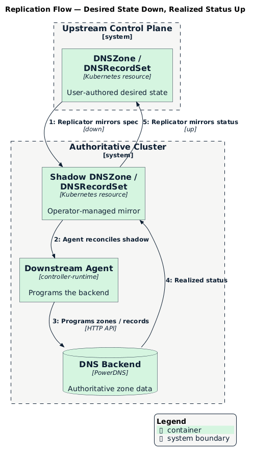

# Replication Model

The replicator bridges two trust boundaries: the **upstream** tenant control
plane, where users author DNS resources, and the **downstream** authoritative
cluster, where the DNS backend runs. It mirrors desired state down, realized
status up, and never gives tenants access to the authoritative cluster.

This document describes how that bridge works. For where each side runs, see
[Deployment Topology](./topology.md).

## Upstream and Downstream

- **Upstream** — a tenant / project control plane (or, in `single` mode, the
  local cluster) holding the user-facing `DNSZone` and `DNSRecordSet`.
- **Downstream** — the shared authoritative cluster where the DNS backend and the
  downstream agent run.

For every upstream resource, the replicator maintains a **shadow object**
downstream. The downstream agent programs the backend from the shadow and writes
realized status onto it; the replicator mirrors that status back upstream. A
change on either side wakes the replicator via cross-cluster watches.

  

## Shadow Objects and Namespace Mapping

Cross-cluster ownership references are not possible in Kubernetes, so the
replicator uses a **mapped-namespace** strategy to place and track shadows:

- Each upstream namespace maps to a downstream namespace named from the upstream
  namespace's UID (`ns-<uid>`), keeping tenant namespaces collision-free without
  leaking their names.
- The shadow keeps the **same object name** as its upstream source.
- **Provenance annotations** (`meta.datumapis.com/upstream-*`) record the source
  cluster, group, kind, name, and namespace on every shadow.
- An **anchor** object downstream stands in for the missing cross-cluster owner
  reference, so garbage collection cleans up shadows when the upstream resource
  is deleted.

Deletion flows downstream-first: the shadow (and its backend state) is removed
before the upstream finalizer is released, so a deleted zone stops resolving
before it disappears from the tenant's view.

## Status Synthesis

The replicator computes the two conditions users watch, combining upstream
validity with downstream reality:

| Condition | Set to `True` when |
|-----------|--------------------|
| `Accepted` | The resource is valid, its dependencies exist, and (for zones) authoritative nameservers are known |
| `Programmed` | The desired state is realized downstream — for a zone, its default `SOA` and `NS` record sets exist; for a record set, the backend has applied it |

Record-set status is mirrored straight from the downstream shadow, including
per-owner results, so a user sees exactly what the backend realized. Zone status
additionally reports the authoritative nameservers and a record count.

## Zone Ownership Accounting

Because many tenant control planes feed one authoritative cluster, two tenants
could request the same domain. The replicator guards against this with an
**ownership ledger** in the authoritative cluster keyed by domain name. The first
zone to claim a domain wins; a later claimant's zone is held with
`Accepted=False` (reason `DNSZoneInUse`) and a warning event, rather than
silently overwriting the incumbent. Ownership is released when the owning zone is
deleted.

## Default SOA and NS Records

A zone is not authoritative until it has `SOA` and `NS` records. Once the zone's
nameservers are known (from its `DNSZoneClass` nameserver policy), the replicator
ensures two operator-managed record sets exist for the apex (`@`):

- an **`NS`** set listing the authoritative nameservers, and
- an **`SOA`** set whose primary nameserver is the first of those, with a
  hostmaster address derived from the domain and sensible refresh/retry/expire
  defaults.

These are created only when missing, so user-authored apex records are never
clobbered, and the backend synthesizes the SOA serial when one is not supplied.

## Discovery of Zone Records

`DNSZoneDiscovery` is a one-shot, read-only companion resource. The replicator
resolves the referenced zone's live records over DNS and writes them into the
resource's status. It is used to snapshot existing DNS during onboarding or
verification and performs no mirroring or backend writes.

## Related

- [Deployment Topology](./topology.md) — Where upstream, downstream, and serving
  layers run
- [API Reference](./api-reference.md) — Conditions and resource schema
