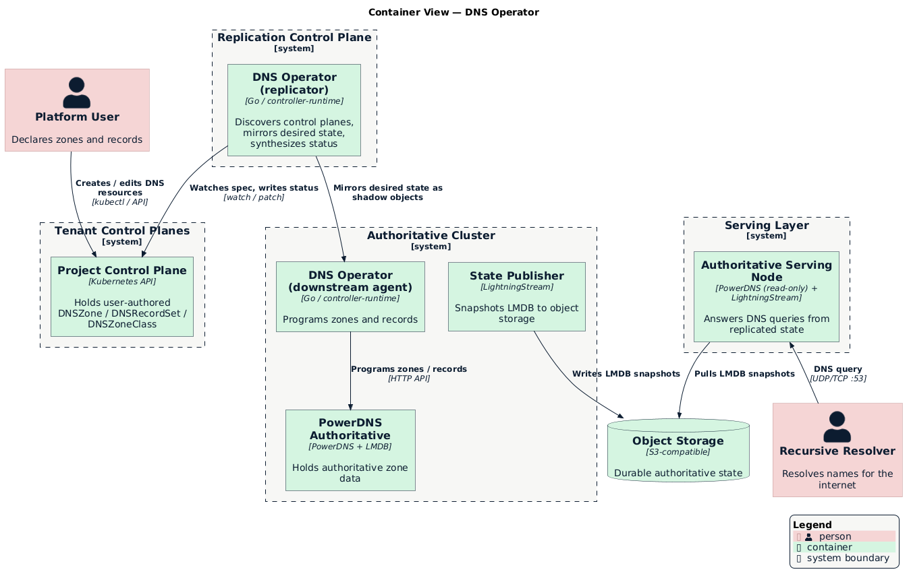

# Deployment Topology

The DNS operator is a single binary that runs in one of two **roles**, selected
with `--role`. A complete deployment composes those roles across a few control
planes and a serving fleet. This document describes the components that are
expected to exist to support the system, independent of any specific cloud or
cluster technology.

> [!NOTE]
>
> This is a generic reference topology. A given environment may collapse or
> expand these tiers — for example, running everything in one cluster for
> development (`discovery.mode: single`) or spreading the serving layer across
> many regions in production.

## Container View

  

## Roles

### Replicator

**Runs in:** the replication control plane, one deployment per platform.

**Responsibilities:**
- Discover the tenant control planes to serve (see [Discovery](#discovery)).
- Mirror each `DNSZone` / `DNSRecordSet` into the authoritative cluster as a
  **shadow object**.
- Ensure a default `SOA` and `NS` record set exist for each zone.
- Account for zone ownership so two tenants cannot claim the same domain.
- Synthesize `Accepted` / `Programmed` status back onto the tenant's resources.

The replicator holds credentials for the authoritative cluster and for each
control plane it discovers; tenants never receive access to the authoritative
cluster. See [Replication Model](./replication.md) for the internals.

### Downstream Agent

**Runs in:** the authoritative cluster, co-located with the DNS backend.

**Responsibilities:**
- Ensure zones exist in the backend for classes it implements, applying the
  class's nameserver policy.
- Translate `DNSRecordSet` resources into authoritative record sets in the
  backend, resolving multi-owner conflicts to a single writer.
- Report realized status (`Programmed`, per-record results) on the shadow
  objects, which the replicator mirrors upstream.

The agent is the **only writer** to the DNS backend. It acts solely on zones
whose `DNSZoneClass.spec.controllerName` matches a backend it implements
(`powerdns` today), so unrelated classes are ignored.

> [!NOTE]
>
> A `single`-mode deployment runs the replicator and agent against the same
> cluster, giving a self-contained DNS service with no separate control plane.
> The `all` role runs both in one process.

## Control Planes and Clusters

| Tier | What runs there | Trust boundary |
|------|-----------------|----------------|
| **Tenant / project control planes** | User-authored `DNSZone`, `DNSRecordSet`, `DNSZoneClass` | Owned by tenants; isolated per project |
| **Platform control plane** | Registry of project control planes used for discovery | Platform-operated |
| **Replication control plane** | DNS operator (replicator role) | Platform-operated; holds cross-cluster credentials |
| **Authoritative cluster** | DNS operator (agent role) + DNS backend | Platform-operated; single writer of authoritative data |
| **Serving layer** | Read-only authoritative servers | Platform-operated; internet-facing |

## Discovery

The replicator's `discovery.mode` (in the [`DNSOperator` server
config](./api-reference.md#dnsoperator-server-config)) selects how upstream
control planes are found:

- **`single`** — the operator serves exactly one upstream cluster: the cluster it
  runs in. No external discovery is performed.
- **`milo`** — the operator queries a **platform control plane** for the set of
  project control planes and connects to each one using a connection template.
  New projects are picked up dynamically as they appear.

Discovery decouples the number of tenants from the operator's deployment: adding
a tenant control plane requires no change to the DNS operator.

## Authoritative Serving and State Replication

The authoritative cluster is the single writer, but it is not necessarily the
node that answers public queries. Authoritative state is replicated out to a
serving layer so queries are answered close to end users:

1. The backend stores authoritative zone data in an embedded **LMDB** store.
2. A **publisher** sidecar (LightningStream) snapshots that store to shared,
   S3-compatible **object storage**.
3. Each **serving node** runs a read-only copy of the backend with a LightningStream
   sidecar in receive mode, pulling snapshots from object storage and serving
   them over standard DNS.

This makes the serving layer horizontally scalable and geographically
distributable: nodes are stateless beyond their local replica, can be added
anywhere object storage is reachable, and are typically fronted by an anycast
address so resolvers reach the nearest node. Serving nodes may also run a local
recursor to expand `ALIAS` records at query time.

The authoritative nameserver names advertised in each zone's `NS` and `SOA`
records (derived from the `DNSZoneClass` nameserver policy) point at this serving
layer.

## Supporting Components

- **Activity policies** — a Kustomize component installs `ActivityPolicy`
  resources into tenant control planes so DNS actions appear as human-readable
  timelines. See [Activity Integration](../enhancements/activity-integration.md).
- **Service catalog** — a `Service` registration publishes DNS into the platform
  service catalog and billing surface. See
  [`config/components/service-catalog`](../../config/components/service-catalog/README.md).
- **Mutating webhook** — stamps display annotations (FQDNs, record values) on
  record sets at admission so activity summaries read naturally.

## Deployment Overlays

The repository ships Kustomize bases and overlays for each role:

| Path | Role | Notes |
|------|------|-------|
| [`config/agent`](../../config/agent) | Downstream agent | Bundles PowerDNS alongside the manager |
| [`config/overlays/replicator`](../../config/overlays/replicator) | Replicator | Wires downstream cluster credentials and discovery mode |
| [`config/milo`](../../config/milo) | Component | Activity policies and resource metrics for tenant control planes |

See the [project README](../../README.md#deploying) for quickstart instructions.
