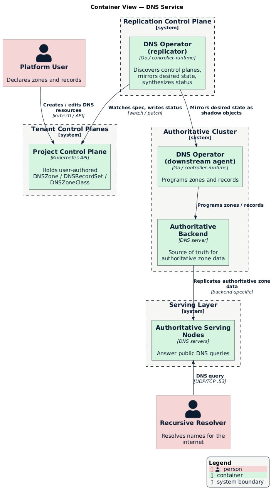

# Deployment Topology

The DNS operator — the service's control-plane component — is a single binary
that runs in one of two **roles**, which you select with `--role`. A complete
deployment composes those roles across a few control planes and a serving fleet.
This document describes the components a deployment needs, independent of any
specific cloud or cluster technology.

> [!NOTE]
>
> This is a generic reference topology. A given environment may collapse or
> expand these tiers — for example, running everything in one cluster for
> development (`discovery.mode: single`) or spreading the serving layer across
> many regions in production.
>
> Concrete per-environment shape — replica counts, serving-node placement, bucket
> and credential wiring — is not defined here. This repository ships the Kustomize
> bases and the reference topology; the deployed configuration for a given
> environment lives with that environment's GitOps configuration.

## Container View

  

## Roles

### Replicator

**Runs in:** the replication control plane, one deployment per platform.

**Responsibilities:**
- Discover the tenant control planes to serve (see [Discovery](#discovery)).
- Mirror each `DNSZone` / `DNSRecordSet` into the authoritative cluster as a
  **shadow object**.
- Ensure a default `SOA` and `NS` record set exist for each zone.
- Account for zone ownership so two tenants cannot claim the same domain.
- Synthesize `Accepted` / `Programmed` status back onto the tenant's resources.

The replicator holds credentials for the authoritative cluster and for each
control plane it discovers; tenants never receive access to the authoritative
cluster. See [Replication Model](./replication.md) for the internals.

### Downstream Agent

**Runs in:** the authoritative cluster, as a sidecar in the DNS backend's own pod
— it programs the backend over loopback, not across the cluster network.

**Responsibilities:**
- Ensure zones exist in the backend for classes it implements, applying the
  class's nameserver policy.
- Translate `DNSRecordSet` resources into authoritative record sets in the
  backend, resolving multi-owner conflicts to a single writer.
- Report realized status (`Programmed`, per-record results) on the shadow
  objects, which the replicator mirrors upstream.

The agent is the **only writer** to the DNS backend, in two senses. It is the
only component that programs authoritative data at all, and it is leader-elected,
so when the agent runs with more than one replica exactly one of them writes at
any moment. It acts only on zones whose `DNSZoneClass.spec.controllerName`
matches a backend it implements (`powerdns` today) and ignores every other class.
See [DNS Backends](./backends/README.md) for the backend model and the servers
the agent can program, and [PowerDNS Backend → Writer
Tier](./backends/powerdns.md#writer-tier) for how the agent and backend share a
pod.

> [!NOTE]
>
> In `single` discovery mode the replicator serves the cluster it runs in, so you
> can point the replicator and agent at one cluster for a self-contained DNS
> service with no separate control plane. Run the two roles as separate
> deployments; select each with `--role`.

## Control Planes and Clusters

| Tier | What runs there | Trust boundary |
|------|-----------------|----------------|
| **Tenant / project control planes** | User-authored `DNSZone`, `DNSRecordSet`, `DNSZoneClass` | Owned by tenants; isolated per project |
| **Platform control plane** | Registry of project control planes used for discovery | Platform-operated |
| **Replication control plane** | DNS operator (replicator role) | Platform-operated; holds cross-cluster credentials |
| **Authoritative cluster** | DNS operator (agent role) + DNS backend | Platform-operated; single writer of authoritative data |
| **Serving layer** | Read-only authoritative servers | Platform-operated; internet-facing |

## Discovery

The replicator's `discovery.mode` (in the
[`DNSOperator` server config](#operator-configuration)) selects how the
replicator finds upstream control planes:

- **`single`** — the operator serves exactly one upstream cluster: the cluster it
  runs in. The operator performs no external discovery.
- **`milo`** — the operator queries a **platform control plane** for the set of
  project control planes and connects to each one using a connection template.
  The operator picks up new projects as they appear.

Discovery decouples the number of tenants from the operator's deployment: adding
a tenant control plane requires no change to the DNS operator.

## Authoritative Serving and State Replication

The authoritative cluster holds the source of truth, but it does not necessarily
answer public queries itself. To scale and distribute serving, a backend can
replicate its authoritative zone data to a separate **serving layer** of
read-only nodes that answer queries close to end users. A simpler backend may
instead answer queries directly from the authoritative server, with no separate
serving layer at all.

Where a serving layer exists, each node holds only its own replica, so you can
add nodes close to users, and an anycast address typically fronts them so
resolvers reach the nearest one.

**How** a backend replicates its data and serves it is backend-specific — zone
transfers, shared storage, and clustered databases are all valid approaches. For
the PowerDNS mechanism — LMDB snapshots shipped through LightningStream to object
storage, dnsdist in front of Authoritative for public queries, and a local
recursor for `ALIAS` expansion — see [PowerDNS Backend →
Storage and Serving](./backends/powerdns.md#storage-and-serving).

Each zone's `NS` and `SOA` records advertise nameserver names from the
`DNSZoneClass` nameserver policy, and those names point at wherever the backend
answers queries.

## Supporting Components

- **Service catalog** — a `Service` registration publishes DNS into the platform
  service catalog and billing surface. See
  [`config/components/service-catalog`](../../config/components/service-catalog/README.md).
- **Mutating webhook** — stamps display annotations (FQDNs, record values) onto
  record sets at admission, so downstream consumers render human-readable names
  without re-deriving them.
- **Validating webhook** — refuses a write that newly claims an owner name
  another record set already holds for the same record type in the same zone.
  Ownership is first-come and only the first claimant is ever programmed, so a
  second claim would sit unpublished; the refusal names the owner name and the
  record set holding it. Only newly claimed names are checked, which leaves a
  record set stored before the guard existed editable and its per-record
  condition visible. The webhook is advisory rather than authoritative: it
  fails open when ownership cannot be established, and the agent's first-come
  election stays the backstop.

## Operator Configuration

You configure the operator binary with a `DNSOperator` object passed via
`--server-config`. The API does not serve this object; it configures a running
instance. Sample:
[`config/agent/server-config.yaml`](../../config/agent/server-config.yaml).

| Field | Default | Description |
|-------|---------|-------------|
| `discovery.mode` | `single` | `single` (local cluster) or `milo` (discover project control planes). |
| `discovery.internalServiceDiscovery` | `false` | Use internal service addresses when connecting to discovered control planes. |
| `discovery.discoveryKubeconfigPath` | — | Kubeconfig for the platform control plane used for discovery. |
| `discovery.projectKubeconfigPath` | — | Connection template for discovered project control planes. |
| `downstreamResourceManagement.kubeconfigPath` | — | Kubeconfig for the authoritative (downstream) cluster. |
| `downstreamResourceManagement.dnsZoneAccountingNamespace` | `datum-downstream-dnszone-accounting` | Namespace holding the zone ownership ledger. |

Each backend contributes its own `controllers.<backend>` tuning and connection
settings. For the PowerDNS controller options and environment variables, see
[PowerDNS Backend → Configuration](./backends/powerdns.md#configuration).

## Deployment Overlays

The repository ships Kustomize bases and overlays for each role:

| Path | Role | Notes |
|------|------|-------|
| [`config/overlays/agent-powerdns`](../../config/overlays/agent-powerdns) | Downstream agent | Runnable agent + PowerDNS: builds on the `config/agent` base and adds the namespace and a storage backend |
| [`config/agent`](../../config/agent) | Downstream agent (base) | Manager, PowerDNS, and config; consumed by the overlay above rather than applied directly |
| [`config/overlays/replicator`](../../config/overlays/replicator) | Replicator | Wires downstream cluster credentials and discovery mode |
| [`config/milo`](../../config/milo) | Component | Installs platform integration resources into tenant control planes |

See the [project README](../../README.md#deploying) for quickstart instructions.
