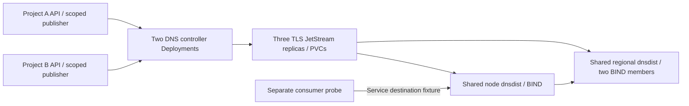

# Internal DNS end-to-end qualification

Run private DNS on the repository's shared Kubernetes test environment. Task
reuses the pinned `datum-cloud/test-infra` bootstrap, cluster names, add-ons, and
cleanup. The environment also supports the existing public DNS regression chain.
The qualification uses Go clients and Kubernetes workloads.

## Run locally

Install Docker, Kind, kubectl, Go, and Task. On macOS, select the suite-owned
Colima runtime before starting the environment:

```sh
colima --profile internal-dns-e2e start --activate=false --cpu 6 --memory 16 --disk 60
source test/internaldns/colima-env.sh
export TASK_X_REMOTE_TASKFILES=1
task --yes env:internal-dns:up
task --yes env:internal-dns:qualify
```

`env:internal-dns:up` resets only the owned private DNS fixtures, then rebuilds
and deploys them on the existing clusters. Run it again before repeating the
qualification. It retains the shared bootstrap and public DNS workloads.

Start private DNS first on fresh clusters to select the shared dual-stack Kind
configuration. If an existing public-only environment uses IPv4, the preflight
stops before resetting private fixtures. When ready to replace that environment,
run `env:down`, then start `env:internal-dns:up` before `env:stack-up`.

To validate public DNS alongside private DNS, use the same lifecycle as CI:

```sh
task --yes env:internal-dns:up
task --yes env:stack-up
task --yes env:internal-dns:qualify
task --yes env:chainsaw
test/internaldns/kubernetes/collect.sh
task --yes env:down
```

`env:down` removes the three shared test clusters. Qualification results and
sanitized deployment logs remain under `test/internaldns/results/kubernetes*`.
Generated kubeconfigs and Secrets stay in `.internal-dns-e2e/kubernetes/` and
are excluded from collected evidence. The qualifier restores controllers and
broker replicas after fault injection, including a failed scenario.

## Deployed path



The `dns-upstream` and `dns-edge` clusters provide independent project APIs.
The `dns-control` cluster hosts the DNS service API, admission Service, broker,
controllers, and fixed serving fleet. All three use the shared Flux,
cert-manager, Kyverno, and Envoy bootstrap. Private and public DNS use separate
namespaces on this foundation.

The manifest renderer reads the shipped runtime configuration and RBAC. Each
controller uses scoped project worker credentials; product, grant issuer, and
VPC integration credentials are separate. The simulated Compute publisher
creates registrations and contributions through the project API. It discovers
managed names from `DNSResolverContext.status.managedNamespace`.

The fleet contains one node member, one regional frontend, and two regional
BIND members, each with independent persistent state. Agents validate and
activate configuration, prove UDP/TCP publication, and renew watchdog leases.
The broker uses three persistent replicas, client and route TLS, and scoped
subject permissions. cert-manager issues broker, client, and admission
certificates. ACK timing matches the shipped 30-second interval and 90-second
lease; the fixture shortens the ownership lease to 10 seconds and pod
termination grace to 2 seconds for fault tests.

## Qualification scenarios

The Go qualifier covers overlapping tenant names over UDP and TCP, A/AAAA and
negative-cache isolation, multiple zones, managed name discovery, scoped
publication and admission denial, record updates and deletion, health
withdrawal and recovery, fixed fleet size, regional publication proof,
controller takeover, local record/access expiry while controllers and the
broker are stopped, and publication after broker/controller restoration using
the retained broker PVCs. Each assertion records its result; skipped scenarios do
not count as passes.

The separate package gate checks the shipped runtime image, all CRD schemas,
deployment rendering, configuration, and Kubernetes/NATS permissions:

```sh
task --yes env:internal-dns:package
```

## Remaining production boundaries

The deployment validates live Kubernetes APIs, admission, credentials, durable
transport, serving pods, and DNS responses. It does not deploy Milo project
discovery, Karmada, Galactic private
service networking, or the actual Compute service. The independent project APIs
and service-side IPv6 routes are explicit fixtures. Exact route/NAT exemptions
preserve serving pod peers without widening their ACLs. The probe does not share a
trusted serving network namespace or receive a Kubernetes credential.

The [production qualification proposal](production-parity.md) covers the next
stage: queries from attached consumer VPCs through authorized private endpoints
into the separate DNS service VPC. Kind cannot establish physical fabric,
microVM attachment, host-loss durability, regional independence, or production
capacity.

The suite requires internal wire version `v1alpha3`, fresh format 4 checkpoints,
and matching controller and fleet versions.
