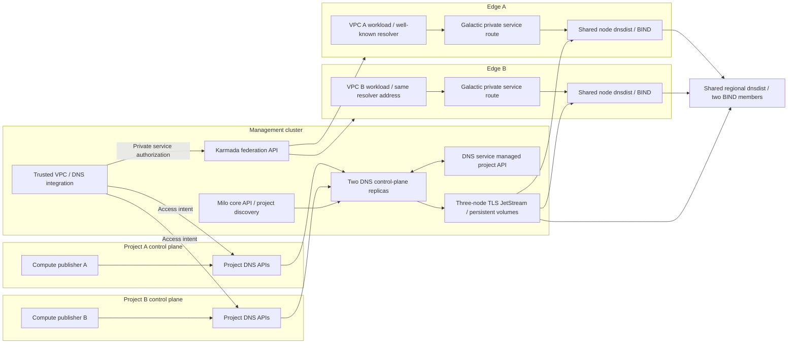

# Production-oriented internal DNS qualification

## Proposal

Build the deployment qualification on the existing `datum-cloud/test-infra`
environment. Use Task for lifecycle, Kubernetes overlays for workloads, and
Chainsaw plus Go clients for assertions and fault injection. Keep the current
Compose suites as protocol and controller regression tests during migration.

The acceptance path starts with a product publishing a record in a project
control plane and ends with a workload querying the well-known resolver address
inside its Galactic VPC. A successful direct query to a generated context
address does not qualify the consumer network path.

## Evidence and gaps

This assessment uses tracked infrastructure declarations at
[`datum-cloud/infra@5cc5caba5`](https://github.com/datum-cloud/infra/tree/5cc5caba5b7f886ca00e7c3ed90726834dac7fac).
Declarations establish the intended configuration; they do not establish live
cluster health or that the proposed private DNS fleet is deployed.

- [DNS control-plane configuration](https://github.com/datum-cloud/infra/tree/5cc5caba5b7f886ca00e7c3ed90726834dac7fac/apps/dns-operator/control-plane/base)
  discovers Milo projects and uses project credentials, certificate trust, and
  an admission service. The current internal DNS lab substitutes independent
  Kind APIs, a development admission proxy, and administrator worker clients.
- [Karmada](https://github.com/datum-cloud/infra/blob/5cc5caba5b7f886ca00e7c3ed90726834dac7fac/infrastructure/karmada/host/base/karmada-helm-release.yaml)
  provides a separate federation API. The current lab has no federation or
  edge API and creates DNS access intent directly.
- [Galactic edge configuration](https://github.com/datum-cloud/infra/blob/5cc5caba5b7f886ca00e7c3ed90726834dac7fac/channels/edge/components/galactic/galactic-system.yaml)
  selects the networking deployment independently. The lab uses Compose routes
  and direct context addresses; it bypasses VPC attachment, private service
  authorization, service route programming, and workload resolver settings.
- [NATS infrastructure](https://github.com/datum-cloud/infra/blob/5cc5caba5b7f886ca00e7c3ed90726834dac7fac/infrastructure/databases/nats/base/nats-hr.yaml)
  declares three broker replicas, persistent JetStream storage, and client and
  route TLS. The lab has one broker. Its outage test proves local expiry, not
  broker quorum, storage recovery, or regional transport.
- [Public edge DNS](https://github.com/datum-cloud/infra/tree/5cc5caba5b7f886ca00e7c3ed90726834dac7fac/apps/dns-operator/downstream/edge)
  uses PowerDNS authoritative servers and Lightningstream. Its loopback
  recursor supports ALIAS expansion. Reuse that public regression environment;
  add the proposed private dnsdist/BIND fleet alongside it. The public recursor
  does not establish private tenant isolation.

The existing [Task environment](../../Taskfile.yaml) already deploys public DNS
across upstream, control, and edge clusters with shared test-infra tooling.
The [CI workflow](../../.github/workflows/e2e.yml) exercises that public chain.
Neither currently runs the internal DNS Compose qualification.
The shared Task include currently uses a branch reference; pin its exact commit
before treating a deployment run as reproducible evidence.

## Target topology

Use three local Kubernetes clusters: management and two edge clusters. Host
the Milo core and Karmada APIs in the management cluster. Exercise two consumer
project APIs and the DNS service's managed project through Milo's project
control-plane routing and distinct credentials; namespaces alone cannot prove
those boundaries. Retain the current independent-source Kind clusters as an
optional API-partition stress test, rather than the required deployment topology.

The two edge clusters initially model independent failure domains in one region.
Galactic owns VPC authorization and destination translation. The DNS integration
publishes short-lived access intent through the DNS APIs; DNS workers do not
watch Galactic resources. Queries carry the authorized service destination to
dnsdist, which supplies PROXYv2 only across protected serving links. Clients
cannot choose another tenant's destination or supply a trusted PROXYv2 header.

Keep fleet size fixed when adding VPCs or zones. Two contexts must share the
same node and regional workloads, with independent regional member storage and
identities. Deploy controllers, agents, watchdogs, dnsdist, and BIND as real
pods from the runtime package, with the same reload and fail-closed helpers
intended for staging. Do not mount the Docker socket into those workloads.

## Qualification stages

1. **Package gate (this PR).** Build the runtime image through
   `config/internal-dns/Dockerfile`, smoke-test its executable as the image's
   non-root user, render all CRDs and deployment examples with the installer's
   pinned Kustomize, and validate their JSON
   configuration, CRD schemas installed in an RBAC-enabled test API, Kubernetes
   permissions, and NATS subject permissions in CI.
   This gate checks packaging; the examples still require deployment overlays
   and serving images. It makes no live Kubernetes or consumer-path claim.
2. **Kubernetes deployment.** Add pinned test-infra and infrastructure inputs,
   concrete serving images and command helpers, and local overlays. Install
   admission through a TLS Service, issue scoped worker and product credentials,
   deploy two controllers, and run the existing publication/expiry/replay cases
   against pods and persistent volumes. Use production ACK timing (30/90
   seconds); any accelerated test must record its timing explicitly. Run the
   public DNS regression chain in the same qualification job.
3. **Consumer network path.** Add real Milo project discovery and the DNS
   service managed project, Karmada and edge resource propagation, Galactic
   VPCs, private service endpoints and route policies, and the trusted access
   integration. Run Go publisher jobs with product credentials and query from
   attached workloads without manually programming context routes. Also test
   an actual feature-flagged Compute build; a publisher fixture alone does not
   qualify the product integration.
4. **Staging and regional resilience.** Reuse those overlays in staging-lab
   for actual Compute attachments and edge networking. Add a second region only
   after defining and deploying its broker and delivery topology; a second edge
   cluster connected to the same broker is not regional replication proof.

## Acceptance and evidence

Each stage must retain the exact Git commits, rendered manifests, image digests,
topology, non-secret identity metadata, observed resource versions, failure
timestamps, DNS responses, and pod logs. Mark each scenario as passed, failed,
or not exercised. Do not count a skipped integration as a passing check.

Required deployment and consumer-path scenarios:

- Overlapping zones, names, and endpoint addresses in two VPCs return distinct
  answers over UDP and TCP, including positive and negative cache isolation.
- Unauthorized access, forged destinations and PROXYv2 headers, and an expired
  service route cannot return another VPC's records. Product credentials cannot
  issue grants or authorize network access.
- Endpoint health withdrawal and recovery, deletion, source API loss, and
  stale-observation replay obey the original deadlines and configured TTLs.
- Either controller can take ownership without stale publication; a healthy
  project continues publishing while another project's API is unavailable.
- Broker leader loss retains publication with quorum; quorum loss, agent
  restart, member failure, and node failure preserve expiry and fail closed.
- Certificate rotation, webhook unavailability, rolling member replacement,
  and PVC reuse do not bypass admission or regress checkpoint authority.
- Adding contexts leaves the workload count fixed, and public authoritative
  DNS still resolves its test records without exposing private zones.

Kind cannot qualify physical fabric, microVM attachment, disk durability across
host loss, production scale, or independent regional failure. Staging-lab owns
those checks. Capacity tests must measure reload/proof latency against the
five-second watchdog budget before increasing shard limits.
